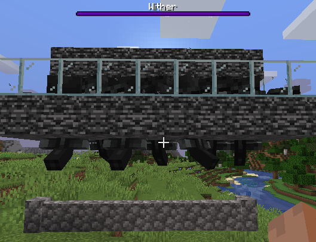
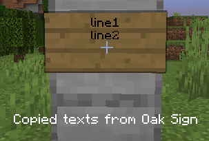
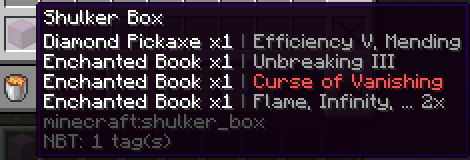

## Tweaks

### autoFillContainerThreshold

The minimum occupied slot amount for the item to trigger tweak tweakmAutoFillContainer

e.g. if you always have 2 slots of firework rocket you can set the value to 3,

 then your rockets will never be used to fill the container

- Category: Tweaks
- Type: integer
- Default value: `2`
- Minimum value: `1`
- Maximum value: `36`

### bossBarMaxEntry

Overwrites the maximum amount of boss bar to be displayed at the same time

It will also skip the vanilla windowHeight/3 limit check

Set it to -1 to disabled (use vanilla logic)

- Category: Tweaks
- Type: integer
- Default value: `-1`
- Minimum value: `-1`
- Maximum value: `20`

### bossBarScale

Scale the boss bar hud with given factor

- Category: Tweaks
- Type: double
- Default value: `1.0`
- Minimum value: `0.001`
- Maximum value: `2.0`

### chatMessageLimit

Modify the maximum number of history messages stored in the chat hud

- Category: Tweaks
- Type: integer
- Default value: `100`
- Minimum value: `100`
- Maximum value: `10000`
- Conflicted mods:
  - `raise-chat-limit`

### connectionSimulatedDelay

Client network delay simulator. Enabled when the value is greater than 0

Adds given delay (in milliseconds) before any packet processing

Basically it stably adds your ping to the server with the given value

- Category: Tweaks
- Type: integer
- Default value: `0`
- Minimum value: `0`
- Maximum value: `15000`

### copySignTextToClipBoard

Copy texts in the sign you are pointing to into the clipboard

- Category: Tweaks
- Type: hotkey
- Default value: *none*

### disableLightUpdates

Yeets client-side light updates

- Category: Tweaks
- Type: togglable hotkey
- Default value: `false`, `false`

### disablePistonBlockBreakingParticle

Remove block breaking particles when pistons break blocks

- Category: Tweaks
- Type: togglable hotkey
- Default value: `false`, `false`
- Required mods:
  - `minecraft >=1.17`

### disableRedstoneWireParticle

Disable particle of redstone wire

- Category: Tweaks
- Type: togglable hotkey
- Default value: `false`, `false`

### handRestockBlackList

The items that will NOT trigger tweakHandRestock

- Category: Tweaks
- Type: string list
- Default value: `[minecraft:lava_bucket]`
- Required mods:
  - `tweakeroo`

### handRestockListType

The item restriction type for tweakHandRestock

- Category: Tweaks
- Type: option list
- Default value: `none`
- Available options: `None`, `Black List`
- Required mods:
  - `tweakeroo`

### handRestockWhiteList

The items that will trigger tweakHandRestock

- Category: Tweaks
- Type: string list
- Default value: `[minecraft:bucket]`
- Required mods:
  - `tweakeroo`

### legacyF3NLogic

Modify the logic of hotkey F3 + N back to 1.15 and before

1.15- logic cheat sheet: creative -> spectator, other -> creative

- Category: Tweaks
- Type: boolean
- Default value: `false`
- Required mods:
  - `minecraft >=1.16`

### maxChatHudHeight

The maximum height of the chat hud

- Category: Tweaks
- Type: integer
- Default value: `160`
- Minimum value: `160`
- Maximum value: `1000`

### netherPortalSoundChance

The chance for a nether portal block to play sound

Set it to 0.001 or 0.0001 for less noisy portal

- Category: Tweaks
- Type: double
- Default value: `0.01`
- Minimum value: `0.0`
- Maximum value: `0.01`

### prioritizedCommandSuggestions

Command suggestions in this list will be more forward in the command completion list

You can put those command completions you always prefer to choose in this list

so they will always be at the head of the command completion list

- Category: Tweaks
- Type: string list
- Default value: `[]`

### refreshInventory

Request a player inventory refresh to the server

It's done by simulating an invalid inventory dragging operation,

so the server think that the inventory is out of sync then do resync

- Category: Tweaks
- Type: hotkey
- Default value: *none*

### safeAfkHealthThreshold

The threshold of the health of the player which triggers the safe afk disconnecting feature

Disconnect when player takes damage and its health becomes less than the given value

- Category: Tweaks
- Type: double
- Default value: `10.0`
- Minimum value: `0.0`
- Maximum value: `100.0`

### scoreboardSideBarScale

Scale the scoreboard side bar hud with given factor

- Category: Tweaks
- Type: double
- Default value: `1.0`
- Minimum value: `0.001`
- Maximum value: `2.0`

### shulkerTooltipEnchantmentHint

Display enchantments of items in the tooltip of shulker box item

- Category: Tweaks
- Type: boolean
- Default value: `false`

### tweakmAutoCleanContainer

Automatically drops everything in the opened container

and then close the container

- Category: Tweaks
- Type: togglable hotkey
- Default value: `false`, `false`
- Required mods:
  - `itemscroller`

### tweakmAutoFillContainer

Automatically fill the opened container with the most numerous item stack in your inventory

iff the item stack is the only most numerous one

and then close the container

- Category: Tweaks
- Type: togglable hotkey
- Default value: `false`, `false`
- Required mods:
  - `itemscroller`

### tweakmAutoPickSchematicBlock

Pick block from schematic automatically before block placement

It's logic is the same as the pickBlock tweaks in litematica mod, you need to enable pickBlockEnabled option in litematica

Does not work with easy place mode

- Category: Tweaks
- Type: togglable hotkey
- Default value: `false`, `false`
- Required mods:
  - `tweakeroo`
  - `litematica`

### tweakmSafeAfk

Disconnect when receive damage

Health threshold to disconnect can be set via safeAfkHealthThreshold

- Category: Tweaks
- Type: togglable hotkey
- Default value: `false`, `false`

### villagerOfferUsesDisplay

Display villager offer use and limit amount on villager offer list

Hover on the arrow of the offer to see it

- Category: Tweaks
- Type: boolean
- Default value: `false`

## Mods Tweaks

### applyTweakerMoreOptionLabelGlobally

Apply the TweakerMore style translated text + original text label to all config GUIs using malilib

- Category: Mods Tweaks
- Type: boolean
- Default value: `false`

### eCraftItemScrollerCompact

Fixed some item scroller functionality doesn't work with easier crafting mod

e.g. broken mass craft

- Category: Mods Tweaks
- Type: boolean
- Default value: `false`
- Required mods:
  - `easiercrafting`
  - `itemscroller`

### ofUnlockF3FpsLimit

Removed 10 FPS render limit for F3 debug hud

- Category: Mods Tweaks
- Type: boolean
- Default value: `false`
- Required mods:
  - `optifabric`
  - `minecraft >=1.15`

### xmapNoSessionFinalizationWait

Skip the session finalization operation of xaero's worldmap when quit a world

So no lag when quitting server or single player

Might have some side effects though

- Category: Mods Tweaks
- Type: boolean
- Default value: `false`
- Required mods:
  - `xaeroworldmap`

## Setting

### hideDisabledOptions

Hide options which are disabled due to mod relations unsatisfied in the config GUI

- Category: Setting
- Type: boolean
- Default value: `false`

### openTweakerMoreConfigGui

Open the config GUI of TweakerMore

- Category: Setting
- Type: hotkey
- Default value: `K,C`

### preserveConfigUnknownEntries

Preserve unknown config entries in TweakerMore's config file

If set to false, unknown entries will be removed on config being written

- Category: Setting
- Type: boolean
- Default value: `true`

### tweakerMoreDebugMode

Debug mode of TweakerMore

When enabled, debug parameter options and options not supported by the current Minecraft version will be displayed

and debugging related functions will be enabled

- Category: Setting
- Type: togglable hotkey
- Default value: `false`, `false`

