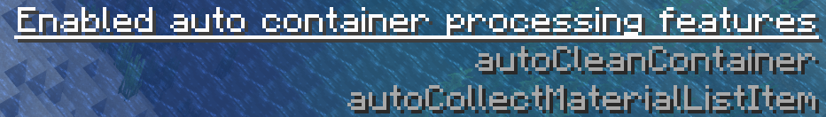
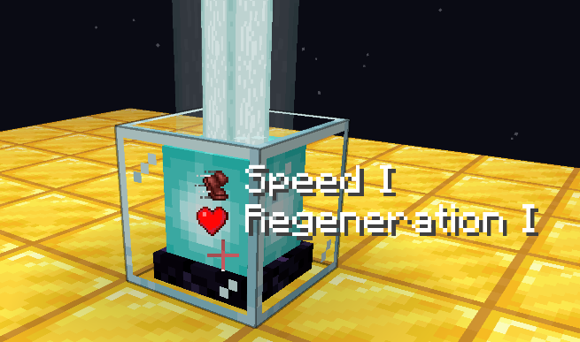
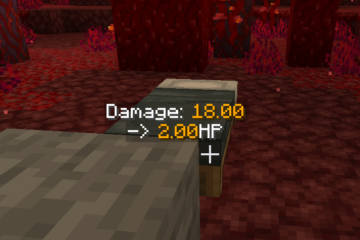

## Features

New features provided by TweakerMore

### autoCleanContainer

Automatically drops everything in the opened container

and then close the container

- Category: Features
- Type: hotkey togglable boolean (Tweak)
- Default value: *no hotkey*, `false`
- Mod restrictions:
  - Required mods:
    - Item Scroller (`itemscroller`)

### autoCleanContainerBlackList

Items that will NOT be thrown out from the container with autoCleanContainer

- Category: Features
- Type: string list (List)
- Default value: `[minecraft:shulker_box]`
- Mod restrictions:
  - Required mods:
    - Item Scroller (`itemscroller`)

### autoCleanContainerListType

The item restriction type for autoCleanContainer

- Category: Features
- Type: option list (List)
- Default value: `None`
- Available options: `None`, `Black List`, `White List`
- Mod restrictions:
  - Required mods:
    - Item Scroller (`itemscroller`)

### autoCleanContainerWhiteList

Items that will be thrown out from the container with autoCleanContainer

- Category: Features
- Type: string list (List)
- Default value: `[minecraft:shulker_box]`
- Mod restrictions:
  - Required mods:
    - Item Scroller (`itemscroller`)

### autoCollectMaterialListItem

Automatically collect missing items in litematica mod material list in the opened container to player inventory

and then close the container

- Category: Features
- Type: hotkey togglable boolean (Tweak)
- Default value: *no hotkey*, `false`
- Mod restrictions:
  - Required mods:
    - Litematica (`litematica`)
    - Item Scroller (`itemscroller`)

### autoCollectMaterialListItemCloseGui

If the container gui should be closed after using the autoCollectMaterialListItem feature

- Category: Features
- Type: boolean (Generic)
- Default value: `true`
- Mod restrictions:
  - Required mods:
    - Litematica (`litematica`)
    - Item Scroller (`itemscroller`)

### autoCollectMaterialListItemMessageType

The way to show information when using the autoCollectMaterialListItem feature

- Category: Features
- Type: option list (List)
- Default value: `Summary`
- Available options: `Full`, `Summary`
- Mod restrictions:
  - Required mods:
    - Litematica (`litematica`)
    - Item Scroller (`itemscroller`)

### autoFillContainer

Automatically fill the opened container with the most numerous item stack in your inventory

iff the item stack is the only most numerous one

and then close the container

- Category: Features
- Type: hotkey togglable boolean (Tweak)
- Default value: *no hotkey*, `false`
- Mod restrictions:
  - Required mods:
    - Item Scroller (`itemscroller`)

### autoFillContainerThreshold

The minimum occupied slot amount for the item to trigger tweak autoFillContainer

e.g. if you always have 2 slots of firework rocket you can set the value to 3,

 then your rockets will never be used to fill the container

- Category: Features
- Type: integer (Generic)
- Default value: `2`
- Minimum value: `1`
- Maximum value: `36`

### autoPickSchematicBlock

Pick block from schematic automatically before block placement

It's logic is the same as the pickBlock tweaks in litematica mod, you need to enable pickBlockEnabled option in litematica

Does not work with easy place mode

- Category: Features
- Type: hotkey togglable boolean (Tweak)
- Default value: *no hotkey*, `false`
- Mod restrictions:
  - Required mods:
    - Litematica (`litematica`)

### autoPutBackExistedItem

Automatically put back all items which also exist in the container from your inventory into the container

and then close the container

- Category: Features
- Type: hotkey togglable boolean (Tweak)
- Default value: *no hotkey*, `false`
- Mod restrictions:
  - Required mods:
    - Item Scroller (`itemscroller`)

### autoRespawn

Automatically perform respawn when the Spectate World/Respawn button in death screen is available

- Category: Features
- Type: hotkey togglable boolean (Tweak)
- Default value: *no hotkey*, `false`

### autoVillagerTradeFavorites

Automatically trigger item scroller's villagerTradeFavorites feature when a merchant screen is opened

and then close the merchant screen

- Category: Features
- Type: hotkey togglable boolean (Tweak)
- Default value: *no hotkey*, `false`
- Mod restrictions:
  - Required mods:
    - Item Scroller (`itemscroller`)
    - Minecraft (`minecraft`) `>=1.16`

### containerProcessorHint

Displays the enabling status of auto container processing related features, including:

- autoCleanContainer

- autoFillContainer

- autoPutBackExistedItem

- autoCollectMaterialListItem

- Category: Features
- Type: hotkey togglable boolean (Tweak)
- Default value: *no hotkey*, `false`

### containerProcessorHintPos

The displayed position of the auto container processor enable status hint

- Category: Features
- Type: option list (Generic)
- Default value: `Top Right`
- Available options: `Top Left`, `Top Right`, `Bottom Left`, `Bottom Right`, `Center`

### containerProcessorHintScale

The font scale of the auto container processor enable status hint

- Category: Features
- Type: double (Generic)
- Default value: `1.0`
- Minimum value: `0.25`
- Maximum value: `4.0`

### copySignTextToClipBoard

Copy texts in the sign you are pointing to into the clipboard

- Category: Features
- Type: hotkey (Hotkey)
- Default value: *no hotkey*

### creativePickBlockWithState

When performing creative pick block action (middle click) with hotkey pressed,

store the target block's block state into the nbt named "BlockStateTag" of the picked item.

So the block state can be restored when you place blocks with the picked item

- Category: Features
- Type: hotkey with switch (Hotkey)
- Default value: `LEFT_ALT`

### infoView

The main switch of the info view feature

Search "infoView" to see related features

- Category: Features
- Type: hotkey togglable boolean (Tweak)
- Default value: *no hotkey*, `false`

### infoViewBeacon

View the status effects of beacons

- Category: Features
- Type: hotkey togglable boolean (Tweak)
- Default value: *no hotkey*, `false`

### infoViewBeaconRenderST (infoViewBeaconRenderStrategy)

The view rendering strategy of infoViewBeacon

- Category: Features
- Type: option list (List)
- Default value: `Always`
- Available options: `View hotkey held`, `Always`

### infoViewBeaconTargetST (infoViewBeaconTargetStrategy)

The target selecting strategy of infoViewBeacon

- Category: Features
- Type: option list (List)
- Default value: `Pointed`
- Available options: `Pointed`, `Beam`

### infoViewBeamAngle

The angle of the initialed cone used in info view strategy "Beam"

Info of blocks within the given degree to player's slight vector will be shown, just like a flashlight

Using degree measure

- Category: Features
- Type: double (Generic)
- Default value: `40.0`
- Minimum value: `1.0`
- Maximum value: `120.0`

### infoViewCommandBlock

Show the command and the output of command blocks

In multiplayer server, command block data can be synced to client using option serverDataSyncer

- Category: Features
- Type: hotkey togglable boolean (Tweak)
- Default value: *no hotkey*, `false`

### infoViewCommandBlockMaxWidth

Maximum width of the displayed text rendered by infoViewCommandBlock

- Category: Features
- Type: integer (Generic)
- Default value: `200`
- Minimum value: `10`
- Maximum value: `2000`

### infoViewCommandBlockRenderST (infoViewCommandBlockRenderStrategy)

The view rendering strategy of infoViewCommandBlock

- Category: Features
- Type: option list (List)
- Default value: `View hotkey held`
- Available options: `View hotkey held`, `Always`

### infoViewCommandBlockTargetST (infoViewCommandBlockTargetStrategy)

The target selecting strategy of infoViewCommandBlock

- Category: Features
- Type: option list (List)
- Default value: `Pointed`
- Available options: `Pointed`, `Beam`

### infoViewCommandBlockTextScale

Scale of the displayed text rendered by infoViewCommandBlock

- Category: Features
- Type: double (Generic)
- Default value: `1.0`
- Minimum value: `0.1`
- Maximum value: `3.0`

### infoViewComparator

View the signal level of comparator

In multiplayer server, comparator block entity data can be synced to client using option serverDataSyncer

- Category: Features
- Type: hotkey togglable boolean (Tweak)
- Default value: *no hotkey*, `false`

### infoViewComparatorRenderST (infoViewComparatorRenderStrategy)

The view rendering strategy of infoViewComparator

- Category: Features
- Type: option list (List)
- Default value: `Always`
- Available options: `View hotkey held`, `Always`

### infoViewComparatorTargetST (infoViewComparatorTargetStrategy)

The target selecting strategy of infoViewComparator

- Category: Features
- Type: option list (List)
- Default value: `Beam`
- Available options: `Pointed`, `Beam`

### infoViewHopper

View the cooldown of hopper

In multiplayer server, hopper block entity data can be synced to client using option serverDataSyncer

- Category: Features
- Type: hotkey togglable boolean (Tweak)
- Default value: *no hotkey*, `false`

### infoViewHopperRenderST (infoViewHopperRenderStrategy)

The view rendering strategy of infoViewHopper

- Category: Features
- Type: option list (List)
- Default value: `Always`
- Available options: `View hotkey held`, `Always`

### infoViewHopperTargetST (infoViewHopperTargetStrategy)

The target selecting strategy of infoViewHopper

- Category: Features
- Type: option list (List)
- Default value: `Beam`
- Available options: `Pointed`, `Beam`

### infoViewRedstoneDustUpdateOrder

Show the block update order of the redstone dust

- Category: Features
- Type: hotkey togglable boolean (Tweak)
- Default value: *no hotkey*, `false`

### infoViewRedstoneDustUpdateOrderRenderST (infoViewRedstoneDustUpdateOrderRenderStrategy)

The view rendering strategy of infoViewRedstoneDustUpdateOrder

- Category: Features
- Type: option list (List)
- Default value: `View hotkey held`
- Available options: `View hotkey held`, `Always`

### infoViewRedstoneDustUpdateOrderTextAlpha

The alpha value of the floating text used in infoViewRedstoneDustUpdateOrder

- Category: Features
- Type: double (Generic)
- Default value: `0.8`
- Minimum value: `0.0`
- Maximum value: `1.0`

### infoViewRenderingKey

The rendering hotkey for info viewers

When the render strategy is "View hotkey held", press to enable rendering

When the render strategy is "Always", it will always rendering ignoring the hotkey's state

- Category: Features
- Type: hotkey (Hotkey)
- Default value: `RIGHT_ALT`

### infoViewRespawnBlockExplosion

Show the explosion damage of respawn blocks located in wrong dimension

It will also estimate and display your remaining health if it explodes

- Category: Features
- Type: hotkey togglable boolean (Tweak)
- Default value: *no hotkey*, `false`

### infoViewRespawnBlockExplosionRenderST (infoViewRespawnBlockExplosionRenderStrategy)

The view rendering strategy of infoViewRespawnBlockExplosion

- Category: Features
- Type: option list (List)
- Default value: `Always`
- Available options: `View hotkey held`, `Always`

### infoViewRespawnBlockExplosionTargetST (infoViewRespawnBlockExplosionTargetStrategy)

The target selecting strategy of infoViewRespawnBlockExplosion

- Category: Features
- Type: option list (List)
- Default value: `Beam`
- Available options: `Pointed`, `Beam`

### infoViewRespawnBlockExplosionTextAlpha

The alpha value of the floating text used in infoViewRespawnBlockExplosion

- Category: Features
- Type: double (Generic)
- Default value: `0.8`
- Minimum value: `0.0`
- Maximum value: `1.0`

### infoViewTargetDistance

The maximum target distance of info view

- Category: Features
- Type: double (Generic)
- Default value: `8.0`
- Minimum value: `4.0`
- Maximum value: `32.0`

### pistorder

Shows the block movement order of a piston. Ported from the Pistorder mod

Right-click a piston base block with an empty hand to show what will happen when the piston pushes / retracts

Nothing will happen if you are sneaking when clicking

For detailed behavior, see https://github.com/Fallen-Breath/pistorder

- Category: Features
- Type: hotkey togglable boolean (Tweak)
- Default value: *no hotkey*, `false`
- Mod restrictions:
  - Conflicted mods:
    - Pistorder (`pistorder`) `<=1.6.0`

### pistorderClearDisplay

An sub-option for pistorder

The hotkey to remove all existing order displays

- Category: Features
- Type: hotkey (Hotkey)
- Default value: `P`
- Mod restrictions:
  - Conflicted mods:
    - Pistorder (`pistorder`) `<=1.6.0`

### pistorderDynamicallyInfoUpdate

An sub-option for pistorder

If existing order displays should dynamically calculate and update their information

- Category: Features
- Type: boolean (Generic)
- Default value: `true`
- Mod restrictions:
  - Conflicted mods:
    - Pistorder (`pistorder`) `<=1.6.0`

### pistorderMaxRenderDistance

An sub-option for pistorder

The maximum render distance for the information texts

- Category: Features
- Type: integer (Generic)
- Default value: `256`
- Minimum value: `0`
- Maximum value: `2048`
- Mod restrictions:
  - Conflicted mods:
    - Pistorder (`pistorder`) `<=1.6.0`

### pistorderMaxSimulationPushLimit

An sub-option for pistorder

When the piston fails to push / retract due to being out of push limit, 

the push limit will be temporarily modified to the given value for calculate all affected blocks

- Category: Features
- Type: integer (Generic)
- Default value: `128`
- Minimum value: `12`
- Maximum value: `1024`
- Mod restrictions:
  - Conflicted mods:
    - Pistorder (`pistorder`) `<=1.6.0`

### pistorderSwingHand

An sub-option for pistorder

Should the player swing its hand when successfully interact with the piston block for order display

- Category: Features
- Type: boolean (Generic)
- Default value: `true`
- Mod restrictions:
  - Conflicted mods:
    - Pistorder (`pistorder`) `<=1.6.0`

### pistorderTextAlpha

An sub-option for pistorder

Alpha of the information text

- Category: Features
- Type: double (Generic)
- Default value: `1.0`
- Minimum value: `0.0`
- Maximum value: `1.0`
- Mod restrictions:
  - Conflicted mods:
    - Pistorder (`pistorder`) `<=1.6.0`

### pistorderTextScale

An sub-option for pistorder

Scale of the information text

- Category: Features
- Type: double (Generic)
- Default value: `1.0`
- Minimum value: `0.1`
- Maximum value: `3.0`
- Mod restrictions:
  - Conflicted mods:
    - Pistorder (`pistorder`) `<=1.6.0`

### pistorderTextShadow

An sub-option for pistorder

If the information text should be rendered with shadow

- Category: Features
- Type: boolean (Generic)
- Default value: `true`
- Mod restrictions:
  - Conflicted mods:
    - Pistorder (`pistorder`) `<=1.6.0`

### refreshInventory

Request a player inventory refresh to the server

It's done by simulating an invalid inventory dragging operation,

so the server think that the inventory is out of sync then do resync

- Category: Features
- Type: hotkey (Hotkey)
- Default value: *no hotkey*

### safeAfk

Disconnect when receive damage

Health threshold to disconnect can be set via safeAfkHealthThreshold

- Category: Features
- Type: hotkey togglable boolean (Tweak)
- Default value: *no hotkey*, `false`

### safeAfkHealthThreshold

The threshold of the health of the player which triggers the safe afk disconnecting feature

Disconnect when player takes damage and its health becomes less than the given value

- Category: Features
- Type: double (Generic)
- Default value: `10.0`
- Minimum value: `0.0`
- Maximum value: `100.0`

### schematicBlockPlacementRestriction

Similar to litematica's placementRestriction option, it cancels block placement when the placement doesn't match current schematic

Unlike litematica's implementation, it uses a simple and accurate constraint strategy,

it works nicely with tweakeroo's placement tweaks

Does not work with litematica's or easy place mode

- Category: Features
- Type: hotkey togglable boolean (Tweak)
- Default value: *no hotkey*, `false`
- Mod restrictions:
  - Required mods:
    - Litematica (`litematica`)

### schematicBlockPlacementRestrictionCheckFacing

Should schematicBlockPlacementRestriction check the facing of the to be placed block

- Category: Features
- Type: hotkey togglable boolean (Tweak)
- Default value: *no hotkey*, `true`

### schematicBlockPlacementRestrictionCheckSlab

Should schematicBlockPlacementRestriction check the slab type of the to be placed slab block

- Category: Features
- Type: hotkey togglable boolean (Tweak)
- Default value: *no hotkey*, `true`

### schematicBlockPlacementRestrictionHint

Switch for displaying hint message when option schematicBlockPlacementRestriction cancels a placement

- Category: Features
- Type: option list (List)
- Default value: `All`
- Available options: `All`, `Operation not allowed `, `Wrong item only`, `Never`

### schematicBlockPlacementRestrictionItemWhitelist

When items in the list are being used, the schematicBlockPlacementRestriction restriction will be ignored

These strings should be valid item ids like "ender_chest" or "minecraft:ender_chest"

You can add scaffolding blocks or your carry-on items into this whitelist for more ease

- Category: Features
- Type: string list (List)
- Default value: `[]`

### schematicBlockPlacementRestrictionMargin

The no-block-placement protection margin length from schematic boxes

e.g. with default value 2, block placements within 2 blocks range of any schematic boxes will be cancelled

Used in option schematicBlockPlacementRestriction

- Category: Features
- Type: integer (Generic)
- Default value: `2`
- Minimum value: `0`
- Maximum value: `16`

### schematicBlockPlacementRestrictionStrict

Strict mode switch for schematicBlockPlacement

When on, block placement is allowed only if the to-be-placed block equals to the schematic block

When off, some incorrect but reasonable block placements are allowed, including:

- place living coral for dead coral

- place ice for water / bubble column / waterlogged block

- Category: Features
- Type: boolean (Generic)
- Default value: `true`

### schematicProPlace

A shortcut option to enable/disable the following options at the same time:

- autoPickSchematicBlock

- schematicBlockPlacementRestriction

With these options enabled, you can have a not-cheaty version of "easy place" from litematica,

which help you auto select target item and cancel wrong block placements

Has all the functions of easy place except for the floating block placing

Compatible with various block placement tweaks from tweakeroo, doesn't work with easy place mode

- Category: Features
- Type: hotkey togglable boolean (Tweak)
- Default value: *no hotkey*, `false`
- Mod restrictions:
  - Required mods:
    - Litematica (`litematica`)

### villagerOfferUsesDisplay

Display villager offer use and limit amount on villager offer list

Hover on the arrow of the offer to see it

- Category: Features
- Type: boolean (Generic)
- Default value: `false`

## MC Tweaks

Tweaks on Minecraft

### barrierParticleAlwaysVisible

Make barrier particles visible without the requirement to hold a barrier item in your hands

Of course, you still need to be in creative mode to see the barrier particles

- Category: MC Tweaks
- Type: hotkey togglable boolean (Tweak)
- Default value: *no hotkey*, `false`

### blockEventThrottler

The switch of the block event throttler tweak

Restricts the amount of client-side block event that can be processed in each game tick

Future incoming block event exceeding the limit will be discarded

- Category: MC Tweaks
- Type: hotkey togglable boolean (Tweak)
- Default value: *no hotkey*, `false`

### blockEventThrottlerTargetBlocks

The target block ids for the blockEventThrottler

Only block event for these blocks will be throttled

- Category: MC Tweaks
- Type: string list (List)
- Default value: `[minecraft:piston, minecraft:sticky_piston]`

### blockEventThrottlerThreshold

The maximum amount of client-side block event that can be processed in each game tick

- Category: MC Tweaks
- Type: integer (Generic)
- Default value: `200`
- Minimum value: `0`
- Maximum value: `10000`

### blockEventThrottlerWhitelistRange

With the player as the center, the given value as the radius, block events within this range will always be processed

So you are always able to observe the piston movement right in front of you

- Category: MC Tweaks
- Type: double (Generic)
- Default value: `8.0`
- Minimum value: `0.0`
- Maximum value: `256.0`

### bossBarMaxEntry

Overwrites the maximum amount of boss bar to be displayed at the same time

It will also skip the vanilla windowHeight/3 limit check

Set it to -1 to disabled (use vanilla logic)

- Category: MC Tweaks
- Type: integer (Generic)
- Default value: `-1`
- Minimum value: `-1`
- Maximum value: `20`

### bossBarScale

Scale the boss bar hud with given factor

- Category: MC Tweaks
- Type: double (Generic)
- Default value: `1.0`
- Minimum value: `0.001`
- Maximum value: `2.0`

### chatMessageLimit

Modify the maximum number of history messages stored in the chat hud

- Category: MC Tweaks
- Type: integer (Generic)
- Default value: `100`
- Minimum value: `100`
- Maximum value: `10000`
- Mod restrictions:
  - Conflicted mods:
    - CheatUtils (`cheatutils`)
    - CompactChat (`compactchat`)
    - MoreChatHistory (`morechathistory`)
    - Parachute (`parachute`)
    - Raise Chat Limit (`raise-chat-limit`)
    - Where's My Chat History (`wmch`)

### connectionSimulatedDelay

Client network delay simulator. Enabled when the value is greater than 0

Adds given delay (in milliseconds) before any packet processing

Basically it stably adds your ping to the server with the given value

- Category: MC Tweaks
- Type: integer (Generic)
- Default value: `0`
- Minimum value: `0`
- Maximum value: `15000`

### copyItemDataToClipBoard

Copy the data of the pointed item in the current gui to the clipboard, as a /give command

- Category: MC Tweaks
- Type: hotkey with switch (Hotkey)
- Default value: `F3,I`

### daytimeOverride

Override the time of day in the client world

Does not affect server-side daytime

- Category: MC Tweaks
- Type: hotkey togglable boolean (Tweak)
- Default value: *no hotkey*, `false`

### daytimeOverrideValue

The client-side daytime value to be overridden by tweak daytimeOverride

- Category: MC Tweaks
- Type: integer (Generic)
- Default value: `0`
- Minimum value: `0`
- Maximum value: `24000`

### disableBeaconBeamRendering

Prevents rendering beacon beams

So beacon beams can never suddenly come out when recording / rendering

- Category: MC Tweaks
- Type: hotkey togglable boolean (Disable)
- Default value: *no hotkey*, `false`

### disableCameraFrustumCulling

Disable rendering culling using camera's frustum, i.e. stuffs outside the player's fov will also be rendered

Affects both block and entity rendering

A use case is to ensure the integrity of shadows when using shaders

Has significant impact on framerate

- Category: MC Tweaks
- Type: hotkey togglable boolean (Disable)
- Default value: *no hotkey*, `false`

### disableCameraSubmersionFog

Disable fog effect caused by camera being submerged in block or fluid, including water, lava and powder snow

It will use the render distance fog instead, just like the camera is in the air

- Category: MC Tweaks
- Type: hotkey togglable boolean (Disable)
- Default value: *no hotkey*, `false`

### disableCreativeFlyClimbingCheck

Prevent creative flying player from entering "ladder climbing" state,

so player's flying movement will not be affected by ladder things

- Category: MC Tweaks
- Type: hotkey togglable boolean (Disable)
- Default value: *no hotkey*, `false`

### disableDarknessEffect

Disable the client-side rendering effect when you have the darkness effect

- Category: MC Tweaks
- Type: hotkey togglable boolean (Disable)
- Default value: *no hotkey*, `false`
- Mod restrictions:
  - Required mods:
    - Minecraft (`minecraft`) `>=1.19`

### disableDarkSkyRendering

Prevent the bottom of the sky from turning dark when you are under sea level

See also: option disableHorizonShadingRendering

- Category: MC Tweaks
- Type: hotkey togglable boolean (Disable)
- Default value: *no hotkey*, `false`

### disableEntityDeathTilting

Disable the tilting rendering effect of death living entities

- Category: MC Tweaks
- Type: hotkey togglable boolean (Disable)
- Default value: *no hotkey*, `false`

### disableEntityModelRendering

Prevent the model of the entity to be rendered

So you can have a clean view of entity collision boxes without being disturbed by entities' random poses

- Category: MC Tweaks
- Type: hotkey togglable boolean (Disable)
- Default value: *no hotkey*, `false`

### disableEntityRenderInterpolation

Disable the entity animation interpolation during rendering

- Category: MC Tweaks
- Type: hotkey togglable boolean (Disable)
- Default value: *no hotkey*, `false`

### disableEntityRenderInterpolationForcedSync

Always set entity's position / angles directly, when receives position / angles update packets of creatures / vehicles

This may resolve the issue when using carpet mod's /tick [freeze|step] command, 

that it may take up to 60gt for the entity's position / angles to be correctly displayed on the client side.

- Category: MC Tweaks
- Type: boolean (Generic)
- Default value: `false`

### disableHorizonShadingRendering

Prevent the horizon from turning dark when you are nearby the world's bottom y

See also: option disableDarkSkyRendering

- Category: MC Tweaks
- Type: hotkey togglable boolean (Disable)
- Default value: *no hotkey*, `false`

### disableLightUpdates

Yeets client-side light updates

- Category: MC Tweaks
- Type: hotkey togglable boolean (Disable)
- Default value: *no hotkey*, `false`

### disablePistonBlockBreakingParticle

Remove block breaking particles when pistons break blocks

- Category: MC Tweaks
- Type: hotkey togglable boolean (Disable)
- Default value: *no hotkey*, `false`
- Mod restrictions:
  - Required mods:
    - Minecraft (`minecraft`) `>=1.17`

### disableRedstoneParticle

Disable all redstone particles

i.e. particles from redstone dust, redstone torch, redstone repeater etc.

- Category: MC Tweaks
- Type: hotkey togglable boolean (Disable)
- Default value: *no hotkey*, `false`

### disableSignTextLengthLimit

Disable the text length limit based on character width when editing or rendering a sign block

A red exclamation mark will be shown on the left side when the limit is exceeded during the editing of the sign

- Category: MC Tweaks
- Type: hotkey togglable boolean (Disable)
- Default value: *no hotkey*, `false`
- Mod restrictions:
  - Conflicted mods:
    - Caxton (`caxton`) `<0.3.0-beta.2`

### disableSlimeBlockBouncing

Disable the bouncing effect on player lands on slime block or bed

Just like you are sneaking

- Category: MC Tweaks
- Type: hotkey togglable boolean (Disable)
- Default value: *no hotkey*, `false`

### disableTiltViewWhenHurt

Disable the screen tilting effect when the current entity is being hurt

- Category: MC Tweaks
- Type: hotkey togglable boolean (Disable)
- Default value: *no hotkey*, `false`

### disableVignetteDarkness

Disable the vignette darkness overlay

i.e. the darkness effect on the screen corner that accumulates slowly

when the light level at player's eyes is not the maximum light level

- Category: MC Tweaks
- Type: hotkey togglable boolean (Disable)
- Default value: *no hotkey*, `false`

### f3IUseRelatedCoordinate

Use related coordinate "~ ~ ~" in the command copied by F3 + I

Affects both /setblock command for blocks and /summon command for entities

See option f3IUseRelatedCoordinateShift1 to shift the related coordinate up by 1 block, i.e. use "~ ~1 ~"

- Category: MC Tweaks
- Type: boolean (Generic)
- Default value: `false`

### f3IUseRelatedCoordinateShift1

Use coordinate "~ ~1 ~" instead of "~ ~ ~" in option f3IUseRelatedCoordinate

- Category: MC Tweaks
- Type: boolean (Generic)
- Default value: `true`

### fakeNightVision

Always use night vision for game rendering, regardless of whether the player actually has night vision

- Category: MC Tweaks
- Type: hotkey togglable boolean (Tweak)
- Default value: *no hotkey*, `false`

### fixChestMirroring

Fixed chest type is not properly transformed when chest block is mirrored

Affects stuffs that use vanilla block mirror logic, e.g. vanilla structure placement, litematica mod schematic placement

- Category: MC Tweaks
- Type: boolean (Fix)
- Default value: `false`

### fixHoverTextScale

Fixed hover text in chat HUD is not scaled when the chat hud is scaled with vanilla chat scale setting

This option make the hover texts scale with the same scaling ratio as the chat HUD

- Category: MC Tweaks
- Type: boolean (Fix)
- Default value: `false`

### flawlessFrames

Forced client to render all changes in loaded chunk for each frames

using the logic from replay mod which is used in its rendering tasks

WARNING: Expect client lag spike with enabled

- Category: MC Tweaks
- Type: hotkey togglable boolean (Tweak)
- Default value: *no hotkey*, `false`
- Mod restrictions:
  - Required mods:
    - Replay mod (`replaymod`)

### flyDrag

Overwrite the drag factor when flying in creative or spectator mode

Overwrites fabric-carpet's rule creativeFlyDrag when the value is modified

- Category: MC Tweaks
- Type: double (Generic)
- Default value: `0.09`
- Minimum value: `0.0`
- Maximum value: `1.0`

### itemTooltipHideUntilMouseMove

Hide item tooltips in container screens until the mouse has moved

With this option, no more need to worry about item tooltips covering too much information in container screens

- Category: MC Tweaks
- Type: boolean (Generic)
- Default value: `false`

### legacyF3NLogic

Modify the logic of hotkey F3 + N back to 1.15 and before

1.15- logic cheat sheet: creative -> spectator, other -> creative

- Category: MC Tweaks
- Type: boolean (Generic)
- Default value: `false`
- Mod restrictions:
  - Required mods:
    - Minecraft (`minecraft`) `>=1.16`

### maxChatHudHeight

The maximum height of the chat hud

- Category: MC Tweaks
- Type: integer (Generic)
- Default value: `160`
- Minimum value: `160`
- Maximum value: `1000`

### multiplayerForcedEnabled

Make the multiplayer functionality of Minecraft forced enabled

With this enabled, you can always access the multiplayer screen despite the status of

your Microsoft / game account, or whether the game is in online or offline mode

- Category: MC Tweaks
- Type: boolean (Generic)
- Default value: `false`
- Mod restrictions:
  - Required mods:
    - Minecraft (`minecraft`) `>=1.16`

### netherPortalSoundChance

The chance for a nether portal block to play sound

Set it to 0.001 or 0.0001 for less noisy portal

- Category: MC Tweaks
- Type: double (Generic)
- Default value: `0.01`
- Minimum value: `0.0`
- Maximum value: `0.01`

### playerNameTagRenderStrategyList

The whitelist / blacklist used in playerNameTagRenderStrategyList

Matching using player's id, case-sensitive

- Category: MC Tweaks
- Type: string list (List)
- Default value: `[]`

### playerNameTagRenderStrategyType

Use whitelist / blacklist to control whether the name tag of the player will be rendered

- Category: MC Tweaks
- Type: option list (List)
- Default value: `None`
- Available options: `None`, `Whitelist`, `Blacklist`

### playerSkinBlockingLoading

Make loading skins of the player blocks the client from running

Client will freeze until player skins is downloaded and loaded

It's useful when you want player skins to always be loaded, e.g. replay video rendering

- Category: MC Tweaks
- Type: boolean (Generic)
- Default value: `false`

### potionItemShouldHaveEnchantmentGlint

Make potion items with effects have enchantment glint overlay again, shinny potions yes!

Reverted the change that Mojang applies in mc1.19.4-pre1

- Category: MC Tweaks
- Type: boolean (Generic)
- Default value: `false`
- Mod restrictions:
  - Required mods:
    - Minecraft (`minecraft`) `>=1.19.4`

### preciseItemEntityModel

Precisely render the item entity model by:

1. Removing the item's hovering and rotating animation

2. Removing the extra stacked item models when the stack contains more than one item

3. Adjusting the model's position and size to ensure the model matches the bounding box precisely

4. Forcing the item model to face south, alternatively configurable with the option preciseItemEntityModelYawSnap

- Category: MC Tweaks
- Type: hotkey togglable boolean (Tweak)
- Default value: *no hotkey*, `false`

### preciseItemEntityModelYawSnap

Works when the option preciseItemEntityModel is on

Snaps the item model to face north, east, south, or west based on the entity's yaw

- Category: MC Tweaks
- Type: boolean (Generic)
- Default value: `false`

### prioritizedCommandSuggestions

Command suggestions in this list will be more forward in the command completion list

You can put those command completions you always prefer to choose in this list

so they will always be at the head of the command completion list

- Category: MC Tweaks
- Type: string list (List)
- Default value: `[]`

### scoreboardSideBarScale

Scale the scoreboard side bar hud with given factor

- Category: MC Tweaks
- Type: double (Generic)
- Default value: `1.0`
- Minimum value: `0.001`
- Maximum value: `2.0`

### serverMsptMetricsStatisticType

Type of the server mspt metrics statistic display in debug hud

Set to "Game tick" to keep vanilla behavior

- Category: MC Tweaks
- Type: option list with hotkey (List)
- Default value: `MSPT (vanilla)`
- Available options: `MSPT (vanilla)`, `Average MSPT per second`, `Maximum MSPT per second`, `Average MSPT per minute`, `Maximum MSPT per minute`

### shulkerItemContentHint

Show a hint of content of shulker box item at the lower-left corner of the shulker box

If the shulker box contains only 1 item type, then that item in the box will be shown 

If the shulker box contains multiple types of item, then "..." will be shown

If the shulker box is empty, no hint will be shown

Also, a fill level bar will be rendered at the lower-right corner,

if the shulker box is neither completely full nor empty

- Category: MC Tweaks
- Type: boolean (Generic)
- Default value: `false`

### shulkerItemContentHintScale

The scale of the hint stuffs in option shulkerItemContentHint

- Category: MC Tweaks
- Type: double (Generic)
- Default value: `0.5`
- Minimum value: `0.01`
- Maximum value: `1.0`

### shulkerTooltipEnchantmentHint

Display enchantments of items in the tooltip of shulker box items

- Category: MC Tweaks
- Type: boolean (Generic)
- Default value: `false`

### shulkerTooltipFillLevelHint

Display content fill level in first line of the tooltip of shulker box items

- Category: MC Tweaks
- Type: boolean (Generic)
- Default value: `false`

### shulkerTooltipHintLengthLimit

The text length limit used during displaying extra information of items in the tooltip of shulker box items

When exceed, remaining information will be folded

- Category: MC Tweaks
- Type: integer (Generic)
- Default value: `120`
- Minimum value: `0`
- Maximum value: `600`

### shulkerTooltipPotionInfoHint

Display potion information of items in the tooltip of shulker box items

- Category: MC Tweaks
- Type: boolean (Generic)
- Default value: `false`

### signEditScreenCancelButton

Add a cancel button to the sign edit screen that cancels the editing and discard all changes

- Category: MC Tweaks
- Type: boolean (Generic)
- Default value: `false`

### signEditScreenEscDiscard

When the sign edit screen is closed by ESC key, discard all changes made

- Category: MC Tweaks
- Type: boolean (Generic)
- Default value: `false`

### signMultilinePasteSupport

Add support for the sign editing screen

to correctly paste multiple lines from clipboard

- Category: MC Tweaks
- Type: boolean (Generic)
- Default value: `false`

### spectatorTeleportMenuIncludeSpectator

Allow spectator players in the player list to be listed in the spectator teleport menu

Spectators will be listed at the end of the menu with gray and italic name

- Category: MC Tweaks
- Type: boolean (Generic)
- Default value: `false`

### steveAlexOnlyDefaultSkins

Make those players who don't have custom skins use only Steve or Alex as their default skins

This brings back the classic behavior from Minecraft < 1.19.3

- Category: MC Tweaks
- Type: boolean (Generic)
- Default value: `false`
- Mod restrictions:
  - Required mods:
    - Minecraft (`minecraft`) `>=1.19.3`

### unlimitedBlockEntityRenderDistance

Set client-side block entity render distance to unlimited

Affect block entities like chests, shulker boxes and skulls

- Category: MC Tweaks
- Type: hotkey togglable boolean (Tweak)
- Default value: *no hotkey*, `false`

### unlimitedEntityRenderDistance

Set client-side entity render distance to unlimited

Still requires the server to send entity packets via EntityTracker properly

- Category: MC Tweaks
- Type: hotkey togglable boolean (Tweak)
- Default value: *no hotkey*, `false`

### weatherOverride

Override the weather of the world in the client world

Does not affect server-side weather

- Category: MC Tweaks
- Type: hotkey togglable boolean (Tweak)
- Default value: *no hotkey*, `false`

### weatherOverrideValue

The client-side weather value to be overridden by tweak weatherOverride

- Category: MC Tweaks
- Type: option list (List)
- Default value: `Clear sky`
- Available options: `Clear sky`, `Rain`, `Thunderstorm`

### yeetServerIpReversedDnsLookup

For servers whose addresses are represented solely by IP, disable reverse DNS lookups in the InetAddress object

Many non-loopback IPs lack associated domain names, which makes reverse lookups time-consuming

This option sets the domain of those servers directly to their IP, bypassing the reverse DNS check

This results in a 1s ~ 5s reduction in time for server list pinging and connections to those servers

- Category: MC Tweaks
- Type: boolean (Generic)
- Default value: `false`

## Mods Tweaks

Tweaks on mods

### applyTweakerMoreOptionLabelGlobally

Apply the TweakerMore style translated text + original text label to all config GUIs using malilib

- Category: Mods Tweaks
- Type: boolean (Generic)
- Default value: `false`

### eCraftItemScrollerCompact

Fixed some item scroller functionality doesn't work with easier crafting mod

e.g. broken mass craft

- Category: Mods Tweaks
- Type: boolean (Generic)
- Default value: `false`
- Mod restrictions:
  - Required mods:
    - EasierCrafting (`easiercrafting`)
    - Item Scroller (`itemscroller`)

### EPR-HideOnDebugHud (eprHideOnDebugHud)

Hide extra player renderer rendering when debug hud (the F3 thing) is enabled

- Category: Mods Tweaks
- Type: boolean (Generic)
- Default value: `false`
- Mod restrictions:
  - Required mods:
    - ExtraPlayerRenderer (`explayerenderer`)

### handRestockBlackList

The items that will NOT trigger tweakHandRestock

- Category: Mods Tweaks
- Type: string list (List)
- Default value: `[minecraft:lava_bucket]`
- Mod restrictions:
  - Required mods:
    - Tweakeroo (`tweakeroo`)

### handRestockListType

The item restriction type for tweakHandRestock

- Category: Mods Tweaks
- Type: option list (List)
- Default value: `None`
- Available options: `None`, `Black List`, `White List`
- Mod restrictions:
  - Required mods:
    - Tweakeroo (`tweakeroo`)

### handRestockWhiteList

The items that will trigger tweakHandRestock

- Category: Mods Tweaks
- Type: string list (List)
- Default value: `[minecraft:bucket]`
- Mod restrictions:
  - Required mods:
    - Tweakeroo (`tweakeroo`)

### Litematica-OriginOverride000 (lmOriginOverride000)

Automatically set origin of litematica schematic to [0, 0, 0] when saving

Also, a special flag will be saved into the .litematic file

If a .litematic file with the special flag is loaded,

the position of the schematic placement will be set to [0, 0, 0] instead of player's position

- Category: Mods Tweaks
- Type: boolean (Generic)
- Default value: `false`
- Mod restrictions:
  - Required mods:
    - Litematica (`litematica`)

### Litematica-RemoveEntityCommand (lmRemoveEntityCommand)

Overrides the name of the command to remove entities in litematica delete mode

The command should be able to accept an entity selector as the only parameter

The activate policy of this option can be specified in option Litematica-RemoveEntityCommandPolicy

As an example, you can use "/removeentity" command from Carpet TIS Addition

Notes: no "/" prefix

- Category: Mods Tweaks
- Type: string (Generic)
- Default value: `kill`
- Mod restrictions:
  - Required mods:
    - Litematica (`litematica`)

### Litematica-RemoveEntityCommandPolicy (lmRemoveEntityCommandPolicy)

The activate policy of option Litematica-RemoveEntityCommand

- auto: Apply the override iif. the given command is valid (clientside check)

- always: Apply the override in all cases

- Category: Mods Tweaks
- Type: option list (Generic)
- Default value: `Auto`
- Available options: `Auto`, `Always`
- Mod restrictions:
  - Required mods:
    - Litematica (`litematica`)

### MiniHUD-DisableLightOverlaySpawnCheck (minihudDisableLightOverlaySpawnCheck)

Mini HUD light level overlay are rendered only on spawn-able block

This option removes the spawn-able check,

so light overlay will be rendered at every non-solid block above a non-air non-fluid block

- Category: Mods Tweaks
- Type: boolean (Generic)
- Default value: `false`
- Mod restrictions:
  - Required mods:
    - MiniHUD (`minihud`)

### MiniHUD-HideIfChatScreenOpened (minihudHideIfChatScreenOpened)

Hide minihud text overlay if the chat screen is opened

- Category: Mods Tweaks
- Type: boolean (Generic)
- Default value: `false`
- Mod restrictions:
  - Required mods:
    - MiniHUD (`minihud`)

### Malilib-ShulkerBoxPreviewSupportEnderChest (mlShulkerBoxPreviewSupportEnderChest)

Add ender chest support, for the shulker box (inventory item) preview functionality of malilib

In multiplayer server, player's ender chest data can be synced to client using option serverDataSyncer

- Category: Mods Tweaks
- Type: boolean (Generic)
- Default value: `false`

### Optifine-RemoveItemFrameItemRenderDistance (ofRemoveItemFrameItemRenderDistance)

Remove the item frame item render distance limit from Optifine

Back to vanilla behavior where the displayed item of item frame is always rendered together with the item frame

- Category: Mods Tweaks
- Type: boolean (Generic)
- Default value: `false`
- Mod restrictions:
  - Required mods:
    - Optifine (`optifabric`)

### Optifine-RemoveSignTextRenderDistance (ofRemoveSignTextRenderDistance)

Remove the sign text render distance limit from Optifine

Back to vanilla behavior where sign text is always rendered together with the sign block

- Category: Mods Tweaks
- Type: boolean (Generic)
- Default value: `false`
- Mod restrictions:
  - Required mods:
    - Optifine (`optifabric`)

### Optifine-SantaHat (ofSantaHat)

Let players wear the santa hat from Optifine when rendering player entities

That's an easter egg during Christmas

- Category: Mods Tweaks
- Type: option list with hotkey (List)
- Default value: `Untouched`
- Available options: `Untouched`, `Apply to me`, `Apply to everyone`
- Mod restrictions:
  - Required mods:
    - Optifine (`optifabric`)

### Optifine-UnlockF3FpsLimit (ofUnlockF3FpsLimit)

Removed 10 FPS render limit for F3 debug hud

- Category: Mods Tweaks
- Type: boolean (Generic)
- Default value: `false`
- Mod restrictions:
  - Required mods:
    - Optifine (`optifabric`)
    - Minecraft (`minecraft`) `>=1.15`

### Optifine-UseVanillaBrightnessCache (ofUseVanillaBrightnessCache)

Let optifine make use vanilla's brightness cache in its LightCacheOF

Increases FPS with smooth lighting on for a few

- Category: Mods Tweaks
- Type: boolean (Generic)
- Default value: `false`
- Mod restrictions:
  - Required mods:
    - Optifine (`optifabric`)

### Optifine-WitchHat (ofWitchHat)

Let players wear the witch hat from Optifine when rendering player entities

That's an easter egg during Halloween

- Category: Mods Tweaks
- Type: option list with hotkey (List)
- Default value: `Untouched`
- Available options: `Untouched`, `Apply to me`, `Apply to everyone`
- Mod restrictions:
  - Required mods:
    - Optifine (`optifabric`)

### Replay-AccurateTimelineTimestamp (replayAccurateTimelineTimestamp)

Display timestamps accurate to milliseconds on the timeline in replay mod

- Category: Mods Tweaks
- Type: boolean (Generic)
- Default value: `false`
- Mod restrictions:
  - Required mods:
    - Replay mod (`replaymod`)

### Replay-FlySpeedLimitMultiplier (replayFlySpeedLimitMultiplier)

Multiple the camera fly speed upper limit in replay mod with given value

So the maximum fly speed can be increased

- Category: Mods Tweaks
- Type: integer (Generic)
- Default value: `1`
- Minimum value: `1`
- Maximum value: `30`
- Mod restrictions:
  - Required mods:
    - Replay mod (`replaymod`)

### serverDataSyncer

Sync entity & block entity datas from the server using vanilla's tag query protocol

Sync when following actions happen:

- Tweakeroo inventory preview

- Litematica schematic saving

- MiniHUD bee hive bee amount display

- Litematica block info overlay

Requires player having OP permission (permission level 2) for it to work

- Category: Mods Tweaks
- Type: hotkey togglable boolean (Tweak)
- Default value: *no hotkey*, `false`
- Mod restrictions:
  - Required mods:
    - Tweakeroo (`tweakeroo`)

  *or*

  - Required mods:
    - Litematica (`litematica`)

  *or*

  - Required mods:
    - MiniHUD (`minihud`)

### serverDataSyncerQueryInterval

The query interval of serverDataSyncer for each batch of queries in game tick

With default value 1 it will send a batch of query every game tick

- Category: Mods Tweaks
- Type: integer (Generic)
- Default value: `1`
- Minimum value: `1`
- Maximum value: `100`

### serverDataSyncerQueryLimit

Maximum amount of queries sent with serverDataSyncer per game tick

Queries exceeding the limit will be delayed

- Category: Mods Tweaks
- Type: integer (Generic)
- Default value: `512`
- Minimum value: `1`
- Maximum value: `8192`

### shaderGameTimeAsWorldTime

Use game time instead of day time as uniform value "worldTime" for Optifine/Iris shaders

So with gamerule doDaylightCycle false this timer variable still increases

- Category: Mods Tweaks
- Type: boolean (Generic)
- Default value: `false`
- Mod restrictions:
  - Required mods:
    - Optifine (`optifabric`)

  *or*

  - Required mods:
    - Iris (`iris`)

### XaeroWorldmap-NoSessionFinalizationWait (xmapNoSessionFinalizationWait)

Skip the session finalization operation of xaero's worldmap when quit a world

So no lag when quitting server or single player

Might have some side effects though

- Category: Mods Tweaks
- Type: boolean (Generic)
- Default value: `false`
- Mod restrictions:
  - Required mods:
    - Xaero's World Map (`xaeroworldmap`)

### XaeroMinimap-WaypointFreecamCompact (xmapWaypointFreecamCompact)

Make the in-game waypoints render correctly when free camera from tweakeroo is enabled

- Category: Mods Tweaks
- Type: boolean (Generic)
- Default value: `false`
- Mod restrictions:
  - Required mods:
    - Tweakeroo (`tweakeroo`)
    - Xaero's Minimap (`xaerominimap`)

  *or*

  - Required mods:
    - Tweakeroo (`tweakeroo`)
    - Better PVP Mod (`xaerobetterpvp`)

## Porting

Stuffs porting from vanilla or mods from other Minecraft versions

### isScrollStacksFallbackFixPorting

Fixed SCROLL_STACKS_FALLBACK of item-scroller ignores the last stack

The same as masa's fixed in itemscoller commit 0984fe7

- Category: Porting
- Type: boolean (Fix)
- Default value: `false`
- Mod restrictions:
  - Required mods:
    - Item Scroller (`itemscroller`)
    - Minecraft (`minecraft`) `<1.18`

### lmCustomSchematicBaseDirectoryEnabledPorting

Backport option customSchematicBaseDirectoryEnabled from Litematica 0.9.0 mc1.17+

- Category: Porting
- Type: boolean (Generic)
- Default value: `false`
- Mod restrictions:
  - Required mods:
    - Litematica (`litematica`)
    - Minecraft (`minecraft`) `<1.17`

### lmCustomSchematicBaseDirectoryPorting

Backport option customSchematicBaseDirectory from Litematica 0.9.0 mc1.17+

- Category: Porting
- Type: string (Generic)
- Default value: `D:\Codes\Minecraft\[Mod]\tweakermore\run\schematics`
- Mod restrictions:
  - Required mods:
    - Litematica (`litematica`)
    - Minecraft (`minecraft`) `<1.17`

### lmPickBlockShulkersPorting

Backport option pickBlockShulkers from Litematica mc1.16+

- Category: Porting
- Type: boolean (Generic)
- Default value: `false`
- Mod restrictions:
  - Required mods:
    - Litematica (`litematica`)
    - Minecraft (`minecraft`) `<1.16`

### mcSpectatorEnterSinkingFixPorting

Backport fix for MC-146582 from mc1.20

It fixes player moving down unexpectedly after entering spectator mode if the player was standing on the ground

- Category: Porting
- Type: boolean (Generic)
- Default value: `false`
- Mod restrictions:
  - Required mods:
    - Minecraft (`minecraft`) `<1.20`

### tkrDisableNauseaEffectPorting

Backports option disableNauseaEffect from Tweakeroo mc1.17+

Also fixes the nether portal overlay fails to be displayed with this option on

- Category: Porting
- Type: hotkey togglable boolean (Disable)
- Default value: *no hotkey*, `false`
- Mod restrictions:
  - Required mods:
    - Minecraft (`minecraft`) `<1.17`

## Setting

Settings of TweakMore itself

### configOriginalNameScale

The scaling factor of the original text label in the option list GUI

- Category: Setting
- Type: double (Generic)
- Default value: `0.65`
- Minimum value: `0.0`
- Maximum value: `1.0`

### hideDisabledOptions

Hide options which are disabled due to mod relations unsatisfied in the config GUI

- Category: Setting
- Type: boolean (Generic)
- Default value: `false`

### openTweakerMoreConfigGui

Open the config GUI of TweakerMore

- Category: Setting
- Type: hotkey (Hotkey)
- Default value: `K,C`

### preserveConfigUnknownEntries

Preserve unknown config entries in TweakerMore's config file

If set to false, unknown entries will be removed on config being written

- Category: Setting
- Type: boolean (Generic)
- Default value: `true`

### tweakerMoreDebugMode

Debug mode of TweakerMore

When enabled, debug parameter options and options not supported by the current Minecraft version will be displayed

and debugging related functions will be enabled

- Category: Setting
- Type: hotkey togglable boolean (Tweak)
- Default value: *no hotkey*, `false`

