## 功能

TweakerMore提供的新功能

### 自动清空容器 (autoCleanContainer)

打开容器后，自动将容器内的所有物品扔出

然后关闭容器

- 分类: 功能
- 类型: 带热键布尔值 (工具)
- 默认值: *无快捷键*, `false`
- 模组约束:
  - 依赖模组:
    - Item Scroller (`itemscroller`)

### 自动清空容器-黑名单 (autoCleanContainerBlackList)

使用自动清空容器功能时不会从容器里中扔出的物品类型

- 分类: 功能
- 类型: 字符串列表 (列表)
- 默认值: `[minecraft:shulker_box]`
- 模组约束:
  - 依赖模组:
    - Item Scroller (`itemscroller`)

### 自动清空容器-名单约束类型 (autoCleanContainerListType)

触发自动清空容器功能的物品名单约束类型

- 分类: 功能
- 类型: 选项列表 (列表)
- 默认值: `None`
- 可用选项: `None`, `Black List`, `White List`
- 模组约束:
  - 依赖模组:
    - Item Scroller (`itemscroller`)

### 自动清空容器-白名单 (autoCleanContainerWhiteList)

使用自动清空容器功能时从容器里中扔出的物品类型

- 分类: 功能
- 类型: 字符串列表 (列表)
- 默认值: `[minecraft:shulker_box]`
- 模组约束:
  - 依赖模组:
    - Item Scroller (`itemscroller`)

### 自动收集材料列表物品 (autoCollectMaterialListItem)

打开容器后，自动收集litematica材料列表中缺失的物品至玩家物品栏

然后关闭容器

- 分类: 功能
- 类型: 带热键布尔值 (工具)
- 默认值: *无快捷键*, `false`
- 模组约束:
  - 依赖模组:
    - Litematica (`litematica`)
    - Item Scroller (`itemscroller`)

### 自动收集材料列表物品-关闭GUI (autoCollectMaterialListItemCloseGui)

在使用自动收集材料列表物品功能后，是否关闭容器的GUI

- 分类: 功能
- 类型: 布尔值 (通用)
- 默认值: `true`
- 模组约束:
  - 依赖模组:
    - Litematica (`litematica`)
    - Item Scroller (`itemscroller`)

### 自动收集材料列表物品-消息类型 (autoCollectMaterialListItemMessageType)

在使用自动收集材料列表物品功能时展示信息的方法

- 分类: 功能
- 类型: 选项列表 (列表)
- 默认值: `摘要`
- 可用选项: `完整`, `摘要`
- 模组约束:
  - 依赖模组:
    - Litematica (`litematica`)
    - Item Scroller (`itemscroller`)

### 自动装填容器 (autoFillContainer)

打开容器后，自动使用物品栏中占用格子数最多的物品装填容器

当且仅当占用格子数最多的物品是唯一的

然后关闭容器

- 分类: 功能
- 类型: 带热键布尔值 (工具)
- 默认值: *无快捷键*, `false`
- 模组约束:
  - 依赖模组:
    - Item Scroller (`itemscroller`)

### 自动装填容器阈值 (autoFillContainerThreshold)

触发功能自动装填容器所需要的最小的物品槽位数

例如，如果你总是带着2个格子的烟花火箭，那么你可以将其设置为3，

那么这些烟花物品将必定不会被用于填充容器

- 分类: 功能
- 类型: 整数 (通用)
- 默认值: `2`
- 最小值: `1`
- 最大值: `36`

### 自动选择原理图方块 (autoPickSchematicBlock)

在放置方块前自动选择原理图中的方块对应的物品

逻辑同litematica模组的pickBlock功能，你需要在litematica mod中启用pickBlockEnabled选项

在轻松放置开启时无效

- 分类: 功能
- 类型: 带热键布尔值 (工具)
- 默认值: *无快捷键*, `false`
- 模组约束:
  - 依赖模组:
    - Litematica (`litematica`)

### 自动放回已存在的物品 (autoPutBackExistedItem)

自动将在容器中也存在的背包物品放回容器中

然后关闭容器

- 分类: 功能
- 类型: 带热键布尔值 (工具)
- 默认值: *无快捷键*, `false`
- 模组约束:
  - 依赖模组:
    - Item Scroller (`itemscroller`)

### 自动重生 (autoRespawn)

自动在死亡界面的旁观世界/重生按钮变为可用时进行重生

- 分类: 功能
- 类型: 带热键布尔值 (工具)
- 默认值: *无快捷键*, `false`

### 自动交易收藏村民交易 (autoVillagerTradeFavorites)

在打开村民交易GUI时自动触发ItemScroller模组的villagerTradeFavorites功能

然后关闭村民交易GUI

- 分类: 功能
- 类型: 带热键布尔值 (工具)
- 默认值: *无快捷键*, `false`
- 模组约束:
  - 依赖模组:
    - Item Scroller (`itemscroller`)
    - Minecraft (`minecraft`) `>=1.16`

### 自动容器处理提示 (containerProcessorHint)

在界面右上角显示自动容器处理相关功能的开启情况，包括：

- 自动清空容器 (autoCleanContainer)

- 自动装填容器 (autoFillContainer)

- 自动放回已存在的物品 (autoPutBackExistedItem)

- 自动收集材料列表物品 (autoCollectMaterialListItem)

- 分类: 功能
- 类型: 带热键布尔值 (工具)
- 默认值: *无快捷键*, `false`

### 自动容器处理提示-位置 (containerProcessorHintPos)

自动容器处理提示渲染时所用的显示位置

- 分类: 功能
- 类型: 选项列表 (通用)
- 默认值: `Top Right`
- 可用选项: `Top Left`, `Top Right`, `Bottom Left`, `Bottom Right`, `Center`

### 自动容器处理提示-字体大小 (containerProcessorHintScale)

自动容器处理提示渲染时所用的字体相对大小

- 分类: 功能
- 类型: 实数 (通用)
- 默认值: `1.0`
- 最小值: `0.25`
- 最大值: `4.0`

### 复制告示牌文本 (copySignTextToClipBoard)

将玩家指向的告示牌中的文本复制到剪贴板

- 分类: 功能
- 类型: 热键 (热键)
- 默认值: *无快捷键*

### 创造模式提取方块带方块状态 (creativePickBlockWithState)

当执行创造模式的提取方块（按下中键）时，如果热键处于按下状态，

则将目标方块的方块状态存储到提取的物品的nbt中，名为“BlockStateTag”

因此，在你用提取的物品放置方块时，你可以直接放下与之前被选择的方块状态相同的方块

- 分类: 功能
- 类型: 带开关热键 (热键)
- 默认值: `LEFT_ALT`

### 信息展示 (infoView)

信息展示相关特性的总开关

搜索"infoView"以查阅相关特性

- 分类: 功能
- 类型: 带热键布尔值 (工具)
- 默认值: *无快捷键*, `false`

### 信息展示-信标 (infoViewBeacon)

展示信标的状态效果

- 分类: 功能
- 类型: 带热键布尔值 (工具)
- 默认值: *无快捷键*, `false`

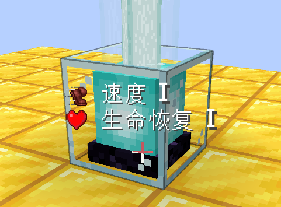

### 信息展示-信标-渲染策略 (infoViewBeaconRenderStrategy)

选项信息展示-信标的渲染策略

- 分类: 功能
- 类型: 选项列表 (列表)
- 默认值: `总是`
- 可用选项: `按住展示热键`, `总是`

### 信息展示-信标-目标策略 (infoViewBeaconTargetStrategy)

选项信息展示-信标的目标选择策略

- 分类: 功能
- 类型: 选项列表 (列表)
- 默认值: `指向`
- 可用选项: `指向`, `光束`

### 信息展示设置-光束渲染策略角度 (infoViewBeamAngle)

在信息展示渲染策略 "光束" 中使用的初始圆锥角度

那些位于玩家视线向量给定角度内的方块信息将被渲染，就像手电筒一样

使用角度制

- 分类: 功能
- 类型: 实数 (通用)
- 默认值: `40.0`
- 最小值: `1.0`
- 最大值: `120.0`

### 信息展示-命令方块 (infoViewCommandBlock)

展示命令方块的指令及其输出

在多人服务器中，命令方块的数据可以通过选项服务端数据同步器同步至客户端

- 分类: 功能
- 类型: 带热键布尔值 (工具)
- 默认值: *无快捷键*, `false`

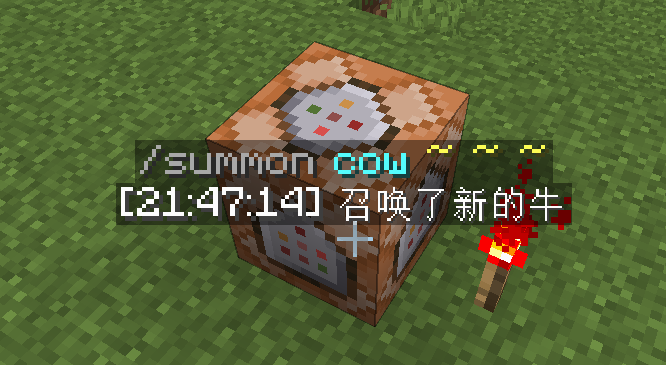

### 信息展示-命令方块-文本宽度最大值 (infoViewCommandBlockMaxWidth)

选项信息展示-命令方块渲染的文本宽度的最大值

- 分类: 功能
- 类型: 整数 (通用)
- 默认值: `200`
- 最小值: `10`
- 最大值: `2000`

### 信息展示-命令方块-渲染策略 (infoViewCommandBlockRenderStrategy)

选项信息展示-命令方块的渲染策略

- 分类: 功能
- 类型: 选项列表 (列表)
- 默认值: `按住展示热键`
- 可用选项: `按住展示热键`, `总是`

### 信息展示-命令方块-目标策略 (infoViewCommandBlockTargetStrategy)

选项信息展示-命令方块的目标选择策略

- 分类: 功能
- 类型: 选项列表 (列表)
- 默认值: `指向`
- 可用选项: `指向`, `光束`

### 信息展示-命令方块-文本缩放 (infoViewCommandBlockTextScale)

选项信息展示-命令方块渲染的文本的缩放比例

- 分类: 功能
- 类型: 实数 (通用)
- 默认值: `1.0`
- 最小值: `0.1`
- 最大值: `3.0`

### 信息展示-比较器 (infoViewComparator)

展示比较器的信号强度

在多人服务器中，比较器方块实体的数据可以通过选项服务端数据同步器同步至客户端

- 分类: 功能
- 类型: 带热键布尔值 (工具)
- 默认值: *无快捷键*, `false`

### 信息展示-比较器-渲染策略 (infoViewComparatorRenderStrategy)

选项信息展示-比较器的渲染策略

- 分类: 功能
- 类型: 选项列表 (列表)
- 默认值: `总是`
- 可用选项: `按住展示热键`, `总是`

### 信息展示-比较器-目标策略 (infoViewComparatorTargetStrategy)

选项信息展示-比较器的目标选择策略

- 分类: 功能
- 类型: 选项列表 (列表)
- 默认值: `光束`
- 可用选项: `指向`, `光束`

### 信息展示-漏斗 (infoViewHopper)

展示漏斗的冷却时间

在多人服务器中，漏斗方块实体的数据可以通过选项服务端数据同步器同步至客户端

- 分类: 功能
- 类型: 带热键布尔值 (工具)
- 默认值: *无快捷键*, `false`

### 信息展示-漏斗-渲染策略 (infoViewHopperRenderStrategy)

选项信息展示-比较器的渲染策略

- 分类: 功能
- 类型: 选项列表 (列表)
- 默认值: `总是`
- 可用选项: `按住展示热键`, `总是`

### 信息展示-漏斗-目标策略 (infoViewHopperTargetStrategy)

选项信息展示-比较器的目标选择策略

- 分类: 功能
- 类型: 选项列表 (列表)
- 默认值: `光束`
- 可用选项: `指向`, `光束`

### 信息展示-红石粉更新顺序 (infoViewRedstoneDustUpdateOrder)

展示红石粉的方块更新顺序

- 分类: 功能
- 类型: 带热键布尔值 (工具)
- 默认值: *无快捷键*, `false`

### 信息展示-红石粉更新顺序-渲染策略 (infoViewRedstoneDustUpdateOrderRenderStrategy)

选项信息展示-红石粉更新顺序的渲染策略

- 分类: 功能
- 类型: 选项列表 (列表)
- 默认值: `按住展示热键`
- 可用选项: `按住展示热键`, `总是`

### 信息展示-红石粉更新顺序-文本透明度 (infoViewRedstoneDustUpdateOrderTextAlpha)

用于渲染信息展示-红石粉更新顺序文本的透明度

- 分类: 功能
- 类型: 实数 (通用)
- 默认值: `0.8`
- 最小值: `0.0`
- 最大值: `1.0`

### 信息展示设置-渲染热键 (infoViewRenderingKey)

触发信息展示相关功能的热键

当渲染策略为"按住展示热键"时，按住此热键以启用渲染

当渲染策略为"总是"时，无论该热键是否被按下，都将启用渲染

- 分类: 功能
- 类型: 热键 (热键)
- 默认值: `RIGHT_ALT`

### 信息展示-重生方块爆炸伤害 (infoViewRespawnBlockExplosion)

展示位于错误维度中重生类方块的爆炸伤害

它还会估计并显示发生爆炸后你的剩余生命值

- 分类: 功能
- 类型: 带热键布尔值 (工具)
- 默认值: *无快捷键*, `false`

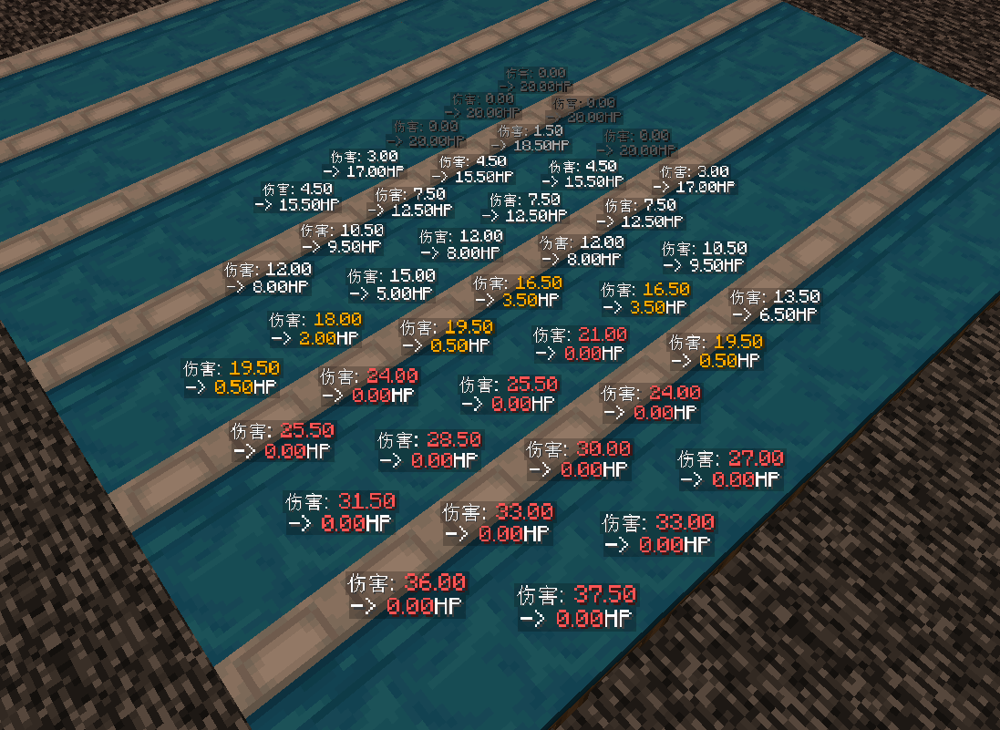

### 信息展示-重生方块爆炸伤害-渲染策略 (infoViewRespawnBlockExplosionRenderStrategy)

选项信息展示-重生方块爆炸伤害的渲染策略

- 分类: 功能
- 类型: 选项列表 (列表)
- 默认值: `总是`
- 可用选项: `按住展示热键`, `总是`

### 信息展示-重生方块爆炸伤害-目标选择策略 (infoViewRespawnBlockExplosionTargetStrategy)

选项信息展示-重生方块爆炸伤害的目标选择策略

- 分类: 功能
- 类型: 选项列表 (列表)
- 默认值: `光束`
- 可用选项: `指向`, `光束`

### 信息展示-重生方块爆炸伤害-文本透明度 (infoViewRespawnBlockExplosionTextAlpha)

用于渲染信息展示-重生方块爆炸伤害文本的透明度

- 分类: 功能
- 类型: 实数 (通用)
- 默认值: `0.8`
- 最小值: `0.0`
- 最大值: `1.0`

### 信息展示-结构方块 (infoViewStructureBlock)

展示结构方块的类型及其结构名

在多人服务器中，结构方块的数据可以通过选项服务端数据同步器同步至客户端

- 分类: 功能
- 类型: 带热键布尔值 (工具)
- 默认值: *无快捷键*, `false`

### 信息展示-结构方块-文本宽度最大值 (infoViewStructureBlockMaxWidth)

选项信息展示-结构方块渲染的文本宽度的最大值

- 分类: 功能
- 类型: 整数 (通用)
- 默认值: `200`
- 最小值: `10`
- 最大值: `2000`

### 信息展示-结构方块-渲染策略 (infoViewStructureBlockRenderStrategy)

选项信息展示-结构方块的渲染策略

- 分类: 功能
- 类型: 选项列表 (列表)
- 默认值: `总是`
- 可用选项: `按住展示热键`, `总是`

### 信息展示-结构方块-目标策略 (infoViewStructureBlockTargetStrategy)

选项信息展示-结构方块的目标选择策略

- 分类: 功能
- 类型: 选项列表 (列表)
- 默认值: `指向`
- 可用选项: `指向`, `光束`

### 信息展示-结构方块-文本缩放 (infoViewStructureBlockTextScale)

选项信息展示-结构方块渲染的文本的缩放比例

- 分类: 功能
- 类型: 实数 (通用)
- 默认值: `1.0`
- 最小值: `0.1`
- 最大值: `3.0`

### 信息展示设置-目标距离 (infoViewTargetDistance)

信息展示目标的最大距离

- 分类: 功能
- 类型: 实数 (通用)
- 默认值: `8.0`
- 最小值: `4.0`
- 最大值: `32.0`

### 活塞顺序展示 (pistorder)

展示活塞的方块移动顺序。移植自Pistorder模组

使用空手右键点击活塞底座以展示活塞推动/收回时将会发生的情况

潜行时点击不会发生任何事情

该选项的详细行为另见 https://github.com/Fallen-Breath/pistorder

- 分类: 功能
- 类型: 布尔值 (通用)
- 默认值: `false`
- 模组约束:
  - 冲突模组:
    - Pistorder (`pistorder`) `<=1.6.0`

### 活塞顺序展示-清空显示 (pistorderClearDisplay)

选项活塞顺序展示的子选项

用于移出所有活塞顺序展示的快捷键

- 分类: 功能
- 类型: 热键 (热键)
- 默认值: `P`
- 模组约束:
  - 冲突模组:
    - Pistorder (`pistorder`) `<=1.6.0`

### 活塞顺序展示-动态信息更新 (pistorderDynamicallyInfoUpdate)

选项活塞顺序展示的子选项

已存在的活塞顺序展示是否应该动态地计算并更新他们的信息

- 分类: 功能
- 类型: 布尔值 (通用)
- 默认值: `true`
- 模组约束:
  - 冲突模组:
    - Pistorder (`pistorder`) `<=1.6.0`

### 活塞顺序展示-最大渲染距离 (pistorderMaxRenderDistance)

选项活塞顺序展示的子选项

展示文本的最大渲染距离

- 分类: 功能
- 类型: 整数 (通用)
- 默认值: `256`
- 最小值: `0`
- 最大值: `2048`
- 模组约束:
  - 冲突模组:
    - Pistorder (`pistorder`) `<=1.6.0`

### 活塞顺序展示-最大模拟推动上限 (pistorderMaxSimulationPushLimit)

选项活塞顺序展示的子选项

在活塞因超出推动上限而无法推出/收回方块时，

将临时把活塞推动上限修改为该选项的值，以完整计算活塞动作将影响的方块

- 分类: 功能
- 类型: 整数 (通用)
- 默认值: `128`
- 最小值: `12`
- 最大值: `1024`
- 模组约束:
  - 冲突模组:
    - Pistorder (`pistorder`) `<=1.6.0`

### 活塞顺序展示-挥动手臂 (pistorderSwingHand)

选项活塞顺序展示的子选项

在空手右键点击活塞底座的操作成功后，玩家是否应该挥一下手

- 分类: 功能
- 类型: 布尔值 (通用)
- 默认值: `true`
- 模组约束:
  - 冲突模组:
    - Pistorder (`pistorder`) `<=1.6.0`

### 活塞顺序展示-文本透明度 (pistorderTextAlpha)

选项活塞顺序展示的子选项

展示文本的透明度

- 分类: 功能
- 类型: 实数 (通用)
- 默认值: `1.0`
- 最小值: `0.0`
- 最大值: `1.0`
- 模组约束:
  - 冲突模组:
    - Pistorder (`pistorder`) `<=1.6.0`

### 活塞顺序展示-文本缩放 (pistorderTextScale)

选项活塞顺序展示的子选项

展示文本的缩放比例

- 分类: 功能
- 类型: 实数 (通用)
- 默认值: `1.0`
- 最小值: `0.1`
- 最大值: `3.0`
- 模组约束:
  - 冲突模组:
    - Pistorder (`pistorder`) `<=1.6.0`

### 活塞顺序展示-文本阴影 (pistorderTextShadow)

选项活塞顺序展示的子选项

展示文本是否启用阴影

- 分类: 功能
- 类型: 布尔值 (通用)
- 默认值: `true`
- 模组约束:
  - 冲突模组:
    - Pistorder (`pistorder`) `<=1.6.0`

### 刷新物品栏 (refreshInventory)

向服务端请求一次玩家物品栏刷新

它将模拟一次无效的物品栏拖动操作，

让服务器认为玩家的物品栏已失去同步并刷新玩家物品栏

- 分类: 功能
- 类型: 热键 (热键)
- 默认值: *无快捷键*

### 安全挂机 (safeAfk)

在受到伤害时断开连接

触发断开连接的玩家血量阈值可以在安全挂机血量阈值中设置

- 分类: 功能
- 类型: 带热键布尔值 (工具)
- 默认值: *无快捷键*, `false`

### 安全挂机血量阈值 (safeAfkHealthThreshold)

触发安全挂机功能的玩家的血量阈值

当玩家受到伤害且血量小于给定值时断开连接

- 分类: 功能
- 类型: 实数 (通用)
- 默认值: `10.0`
- 最小值: `0.0`
- 最大值: `100.0`

### 原理图方块放置限制 (schematicBlockPlacementRestriction)

与litematica的放置限制(placementRestriction)选项类似，它将取消与原理图不匹配的方块的放置

但与litematica的实现不同的是，它使用了一个简单又准确的约束策略，

可以完美地与tweakeroo的方块放置功能兼容

在litematica的放置限制或轻松放置开启时无效

- 分类: 功能
- 类型: 带热键布尔值 (工具)
- 默认值: *无快捷键*, `false`
- 模组约束:
  - 依赖模组:
    - Litematica (`litematica`)

### 原理图方块放置限制-检查方块朝向 (schematicBlockPlacementRestrictionCheckFacing)

选项“原理图方块放置限制”是否应该检查将要放置的方块的朝向

- 分类: 功能
- 类型: 带热键布尔值 (工具)
- 默认值: *无快捷键*, `true`

### 原理图方块放置限制-检查半砖类型 (schematicBlockPlacementRestrictionCheckSlab)

选项“原理图方块放置限制”是否应该检查将要放置的半砖的半砖类型

- 分类: 功能
- 类型: 带热键布尔值 (工具)
- 默认值: *无快捷键*, `true`

### 原理图方块放置限制-提示 (schematicBlockPlacementRestrictionHint)

在原理图方块放置限制取消方块放置时提示信息的开关

- 分类: 功能
- 类型: 选项列表 (列表)
- 默认值: `全部`
- 可用选项: `全部`, `不允许的操作`, `仅物品错误`, `总不`

### 原理图方块放置限制-物品白名单 (schematicBlockPlacementRestrictionItemWhitelist)

列表中的物品在被使用时，可以忽略原理图方块放置限制的限制

这些字符串应该为合法的物品id，如"ender_chest"或"minecraft:ender_chest"

你可以把脚手架方块或者随身物品添加进这个白名单里，这样会有更加舒适的体验

- 分类: 功能
- 类型: 字符串列表 (列表)
- 默认值: `[]`

### 原理图方块放置限制-边缘保护 (schematicBlockPlacementRestrictionMargin)

用于阻止位于原理图框附近的方块放置的放置保护距离

例如，在使用默认值为2时，距离任意原理图2米范围内的方块放置将被取消

选项原理图方块放置限制将使用本规则的值

- 分类: 功能
- 类型: 整数 (通用)
- 默认值: `2`
- 最小值: `0`
- 最大值: `16`

### 原理图方块放置限制-严格方块检查 (schematicBlockPlacementRestrictionStrict)

schematicBlockPlacement的严格模式

若开启，方块放置只在将要放置的方块与原理图中的方块匹配时被允许

若关闭，一些错误但又有道理的的方块放置将被允许，包括：

- 使用活珊瑚来“放置”死珊瑚

- 使用冰来“放置”水源/气泡柱/含水方块

- 分类: 功能
- 类型: 布尔值 (通用)
- 默认值: `true`

### 专业原理图方块放置 (schematicProPlace)

同时开启/关闭以下功能的一个快捷选项:

- 自动选择原理图方块 (autoPickSchematicBlock)

- 原理图方块放置限制 (schematicBlockPlacementRestriction)

启用这些选项后，你就有了一个litematica的轻松放置的非作弊版本，

它可以帮助您自动选择目标物品，并取消错误方块的放置

拥有着轻松放置除了浮空放置方块外的所有功能

兼容tweakeroo的各种方块放置功能，在轻松放置开启时无效

- 分类: 功能
- 类型: 带热键布尔值 (工具)
- 默认值: *无快捷键*, `false`
- 模组约束:
  - 依赖模组:
    - Litematica (`litematica`)

### 村民交易次数显示 (villagerOfferUsesDisplay)

在村民交易列表中显示当前交易的次数以及上限

将指针移至交易的箭头上来以显示    

- 分类: 功能
- 类型: 布尔值 (通用)
- 默认值: `false`

## MC修改

对Minecraft已有内容修改

### 屏障粒子始终可见 (barrierParticleAlwaysVisible)

让屏障的粒子效果在玩家未手持屏障物品时也依然可被渲染

当然，你还是需要处于创造模式才能让屏障粒子显形

- 分类: MC修改
- 类型: 带热键布尔值 (工具)
- 默认值: *无快捷键*, `false`

### 方块事件节流阀 (blockEventThrottler)

方块事件节流阀功能的总开关

约束每个游戏刻内，客户端可以处理的方块事件数量

超出限制的方块事件将被抛弃

- 分类: MC修改
- 类型: 带热键布尔值 (工具)
- 默认值: *无快捷键*, `false`

### 方块事件节流阀-目标方块 (blockEventThrottlerTargetBlocks)

方块事件节流阀的目标方块种类

只有这些方块的方块事件会被节流

- 分类: MC修改
- 类型: 字符串列表 (列表)
- 默认值: `[minecraft:piston, minecraft:sticky_piston]`

### 方块事件节流阀-阈值 (blockEventThrottlerThreshold)

每个游戏刻内，客户端可以处理的方块事件数量上限

- 分类: MC修改
- 类型: 整数 (通用)
- 默认值: `200`
- 最小值: `0`
- 最大值: `10000`

### 方块事件节流阀-白名单半径 (blockEventThrottlerWhitelistRange)

以玩家为中心，给定值为半径，那么这个范围内发生的方块事件将总会被处理

借此，你总是可以观察到您面前的活塞运动

- 分类: MC修改
- 类型: 实数 (通用)
- 默认值: `8.0`
- 最小值: `0.0`
- 最大值: `256.0`

### Boss栏最大条目数 (bossBarMaxEntry)

修改最大同时显示的Boss栏条目数量

它也会跳过原版的 窗口高度/3 限制检查

将其设置为-1以禁用 (沿用原版逻辑)

- 分类: MC修改
- 类型: 整数 (通用)
- 默认值: `-1`
- 最小值: `-1`
- 最大值: `20`

### Boss栏缩放 (bossBarScale)

将Boss栏按照给定参数进行缩放显示

- 分类: MC修改
- 类型: 实数 (通用)
- 默认值: `1.0`
- 最小值: `0.001`
- 最大值: `2.0`

### 聊天信息数量上限 (chatMessageLimit)

修改聊天栏的历史信息储存数量上限

- 分类: MC修改
- 类型: 整数 (通用)
- 默认值: `100`
- 最小值: `100`
- 最大值: `10000`
- 模组约束:
  - 冲突模组:
    - CheatUtils (`cheatutils`)
    - CompactChat (`compactchat`)
    - MoreChatHistory (`morechathistory`)
    - Parachute (`parachute`)
    - Raise Chat Limit (`raise-chat-limit`)
    - Where's My Chat History (`wmch`)

### 网络连接延迟模拟 (connectionSimulatedDelay)

客户端网络延迟模拟器，于给定值大于0时启用

在任何数据包处理前插入给定的延迟 (单位毫秒)

可以认为它会稳定地将你的网络延迟ping值增加给定的值

- 分类: MC修改
- 类型: 整数 (通用)
- 默认值: `0`
- 最小值: `0`
- 最大值: `15000`

### 复制物品数据 (copyItemDataToClipBoard)

Copy the data of the pointed item in the current gui to the clipboard, as a /give command把当前GUI中指向的物品数据复制到剪贴板

- 分类: MC修改
- 类型: 带开关热键 (热键)
- 默认值: `F3,I`

### 覆盖世界时间 (daytimeOverride)

覆盖客户端中的世界时间

对服务端无影响

- 分类: MC修改
- 类型: 带热键布尔值 (工具)
- 默认值: *无快捷键*, `false`

### 覆盖世界时间数值 (daytimeOverrideValue)

用于功能覆盖世界时间的客户端的世界时间数值

- 分类: MC修改
- 类型: 整数 (通用)
- 默认值: `0`
- 最小值: `0`
- 最大值: `24000`

### 禁用信标光束渲染 (disableBeaconBeamRendering)

阻止游戏渲染信标光束

这样信标光束就不会在你录像或渲染的时候突然出现

- 分类: MC修改
- 类型: 带热键布尔值 (禁用)
- 默认值: *无快捷键*, `false`

### 禁用相机视锥体渲染剔除 (disableCameraFrustumCulling)

禁用基于相机视锥体的渲染剔除，即玩家视野范围外的画面也会被渲染

方块和实体的渲染均受影响

常用于保证光影下阴影的完整性等

对帧数有明显影响

- 分类: MC修改
- 类型: 带热键布尔值 (禁用)
- 默认值: *无快捷键*, `false`

### 禁用相机浸没迷雾 (disableCameraSubmersionFog)

禁用由于相机浸没在方块或流体中，包括水、熔岩和粉雪，而造成的迷雾效果

它将使用渲染距离的雾将被使用，就像相机在空气中一样

- 分类: MC修改
- 类型: 带热键布尔值 (禁用)
- 默认值: *无快捷键*, `false`

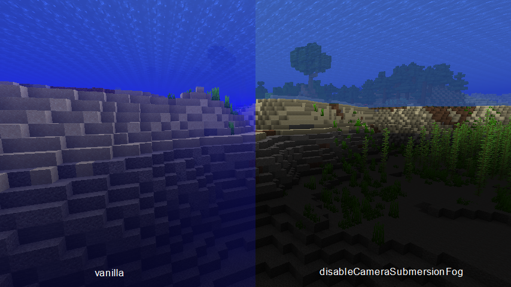

### 禁用创造模式飞行攀爬 (disableCreativeFlyClimbingCheck)

阻止创造模式玩家在飞行时进入"在梯子上攀爬"的状态，

这样玩家的飞行移动就能不受梯子等方块的影响

- 分类: MC修改
- 类型: 带热键布尔值 (禁用)
- 默认值: *无快捷键*, `false`

### 禁用黑暗状态效果 (disableDarknessEffect)

禁用黑暗状态效果所提供的客户端渲染效果

- 分类: MC修改
- 类型: 带热键布尔值 (禁用)
- 默认值: *无快捷键*, `false`
- 模组约束:
  - 依赖模组:
    - Minecraft (`minecraft`) `>=1.19`

### 禁用天空渲染变暗 (disableDarkSkyRendering)

阻止天空的下半部分在玩家位于海平面以下时变暗的渲染效果

另见: 选项禁用地平线渲染变暗

- 分类: MC修改
- 类型: 带热键布尔值 (禁用)
- 默认值: *无快捷键*, `false`

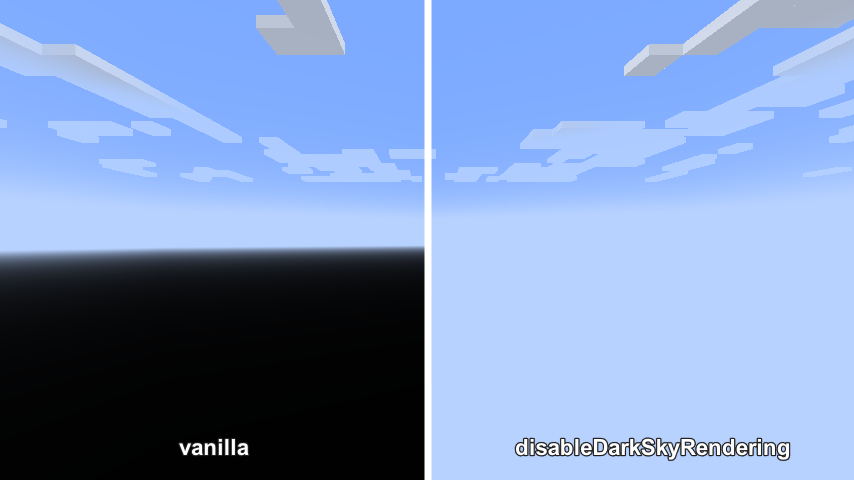

### 禁用实体死亡倾斜 (disableEntityDeathTilting)

禁用生物实体死亡时的倾斜渲染效果

- 分类: MC修改
- 类型: 带热键布尔值 (禁用)
- 默认值: *无快捷键*, `false`

### 禁用实体模型渲染 (disableEntityModelRendering)

阻止游戏渲染实体的模型

这样你就可以清晰地观察实体的碰撞箱，不需要担心被实体乱七八糟的姿势扰乱视线

- 分类: MC修改
- 类型: 带热键布尔值 (禁用)
- 默认值: *无快捷键*, `false`

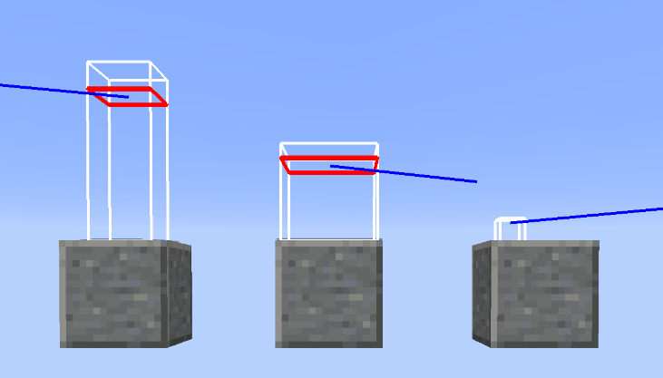

### 禁用实体渲染插值 (disableEntityRenderInterpolation)

禁用在渲染过程中实体的动画插值

- 分类: MC修改
- 类型: 带热键布尔值 (禁用)
- 默认值: *无快捷键*, `false`

### 禁用实体渲染插值-强制同步 (disableEntityRenderInterpolationForcedSync)

在客户端接收到生物/载具的位置/朝向更新数据包时，总是直接设置该实体的位置/朝向

这可缓解在carpet mod的/tick [freeze|step]操作下，

可能需要等待最长60gt，才能在客户端正确显示实体位置/朝向的问题

- 分类: MC修改
- 类型: 布尔值 (通用)
- 默认值: `false`

### 禁用地平线渲染变暗 (disableHorizonShadingRendering)

阻止地平线在玩家接近世界最低y值时变暗的渲染效果

另见: 选项禁用天空渲染变暗

- 分类: MC修改
- 类型: 带热键布尔值 (禁用)
- 默认值: *无快捷键*, `false`

### 禁用光照更新 (disableLightUpdates)

禁用客户端光照更新

- 分类: MC修改
- 类型: 带热键布尔值 (禁用)
- 默认值: *无快捷键*, `false`

### 禁用活塞方块破坏粒子效果 (disablePistonBlockBreakingParticle)

移除活塞破坏方块时生成的粒子效果

- 分类: MC修改
- 类型: 带热键布尔值 (禁用)
- 默认值: *无快捷键*, `false`
- 模组约束:
  - 依赖模组:
    - Minecraft (`minecraft`) `>=1.17`

### 禁用红石粒子效果 (disableRedstoneParticle)

禁用所有的红石粒子效果

即来自红石粉、红石火把、红石中继器等的粒子效果

- 分类: MC修改
- 类型: 带热键布尔值 (禁用)
- 默认值: *无快捷键*, `false`

### 禁用告示牌文本长度限制 (disableSignTextLengthLimit)

禁用在编辑或渲染告示牌时，告示牌基于字符长度的文本长度限制

在编辑告示牌过程中，超出限制长度时，文本左侧会显示红色感叹号

- 分类: MC修改
- 类型: 带热键布尔值 (禁用)
- 默认值: *无快捷键*, `false`
- 模组约束:
  - 冲突模组:
    - Caxton (`caxton`) `<0.3.0-beta.2`

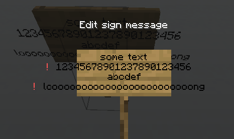

### 禁用史莱姆方块弹跳 (disableSlimeBlockBouncing)

禁用玩家落在史莱姆方块或床上的反弹效果

就像你潜行了一样

- 分类: MC修改
- 类型: 带热键布尔值 (禁用)
- 默认值: *无快捷键*, `false`

### 禁用受伤时屏幕倾斜效果 (disableTiltViewWhenHurt)

禁用当前实体受伤时屏幕的倾斜抖动效果

- 分类: MC修改
- 类型: 带热键布尔值 (禁用)
- 默认值: *无快捷键*, `false`

### 禁用暗角渲染 (disableVignetteDarkness)

禁用暗角渲染覆盖层

即那个当玩家眼睛处的亮度小于最大亮度时，

画面四角会逐渐变暗的效果

- 分类: MC修改
- 类型: 带热键布尔值 (禁用)
- 默认值: *无快捷键*, `false`

### F3+I使用相对坐标 (f3IUseRelatedCoordinate)

在F3+I复制指令时，使用相对坐标 ~ ~ ~

影响复制的方块/setblock指令和实体/summon指令

另见选项F3+I使用相对坐标-上移1m来把相对坐标上移一格，即使用 ~ ~1 ~

- 分类: MC修改
- 类型: 布尔值 (通用)
- 默认值: `false`

### F3+I使用相对坐标-上移1m (f3IUseRelatedCoordinateShift1)

在选项F3+I使用相对坐标中，使用坐标 ~ ~1 ~ 代替 ~ ~ ~

- 分类: MC修改
- 类型: 布尔值 (通用)
- 默认值: `true`

### 伪夜视 (fakeNightVision)

总是运用夜视效果下的游戏渲染，无论玩家是否确实拥有夜视效果

- 分类: MC修改
- 类型: 带热键布尔值 (工具)
- 默认值: *无快捷键*, `false`

### 修复箱子镜像变换 (fixChestMirroring)

修复箱子方块在进行镜像变换时没有正确地处理其chest_type属性

对使用了原版方块镜像逻辑的功能有效，包括原版结构放置、litematica mod的原理图放置

- 分类: MC修改
- 类型: 布尔值 (修复)
- 默认值: `false`

### 修复悬浮文本缩放 (fixHoverTextScale)

Format error: 修复使用原版聊天缩放设置来缩放聊天信息HUD中的文本时，其悬浮文本没有被缩放，仍保持100%比例

这个选项让悬浮文本也使用相同的缩放比例进行缩放

- 分类: MC修改
- 类型: 布尔值 (修复)
- 默认值: `false`

### 无瑕世界渲染 (flawlessFrames)

强制客户端渲染世界时每一帧都更新完毕所有已加载区块中的变化

借用了Replay模组渲染各种任务时所使用的逻辑

警告：这可能会让客户端频繁地卡顿

- 分类: MC修改
- 类型: 带热键布尔值 (工具)
- 默认值: *无快捷键*, `false`
- 模组约束:
  - 依赖模组:
    - Replay mod (`replaymod`)

### 玩家飞行阻力 (flyDrag)

覆盖玩家在创造模式或旁观模式下的飞行阻力因子

在该选项被修改时，fabric-carpet规则creativeFlyDrag的效果将被覆盖

- 分类: MC修改
- 类型: 实数 (通用)
- 默认值: `0.09`
- 最小值: `0.0`
- 最大值: `1.0`

### 隐藏物品悬浮文本直至鼠标移动 (itemTooltipHideUntilMouseMove)

在容器GUI中隐藏物品的悬浮文本，直至鼠标移动

借此，无需再担心物品的悬浮文本遮挡过多容器GUI中的物品图标信息

- 分类: MC修改
- 类型: 布尔值 (通用)
- 默认值: `false`

### 旧版F3+N逻辑 (legacyF3NLogic)

修改快捷键F3+N的逻辑至1.15及之前的逻辑

提示，1.15以前的逻辑为：创造模式->旁观者模式、其他模式->创造模式

- 分类: MC修改
- 类型: 布尔值 (通用)
- 默认值: `false`
- 模组约束:
  - 依赖模组:
    - Minecraft (`minecraft`) `>=1.16`

### 最大聊天界面高度 (maxChatHudHeight)

聊天界面高度的最大值

- 分类: MC修改
- 类型: 整数 (通用)
- 默认值: `160`
- 最小值: `160`
- 最大值: `1000`

### 强制启用多人游戏 (multiplayerForcedEnabled)

令Minecraft的多人游戏功能始终可用

在启用该选项时，无论你的微软/游戏账户状态如何，

不管游戏是在正版还是离线模式下，你都可以访问多人游戏界面

- 分类: MC修改
- 类型: 布尔值 (通用)
- 默认值: `false`
- 模组约束:
  - 依赖模组:
    - Minecraft (`minecraft`) `>=1.16`

### 地狱门音效概率 (netherPortalSoundChance)

地狱门方块播放音效的概率

将其设为0.001或0.0001来让地狱门没那么吵

- 分类: MC修改
- 类型: 实数 (通用)
- 默认值: `0.01`
- 最小值: `0.0`
- 最大值: `0.01`

### 玩家名称标签渲染策略-列表 (playerNameTagRenderStrategyList)

玩家名称标签渲染策略所使用的的白名单/黑名单

用玩家id进行匹配，区分大小写

- 分类: MC修改
- 类型: 字符串列表 (列表)
- 默认值: `[]`

### 玩家名称标签渲染策略-类型 (playerNameTagRenderStrategyType)

通过白名单/黑名单来控制玩家名称标签是否被渲染

- 分类: MC修改
- 类型: 选项列表 (列表)
- 默认值: `无`
- 可用选项: `无`, `白名单`, `黑名单`

### 阻塞型玩家皮肤加载 (playerSkinBlockingLoading)

让加载玩家皮肤这一操作阻塞客户端的运行

客户端卡住，直到玩家的皮肤下载完毕并被成功加载

如果你希望玩家的皮肤永远处于已加载的状态，比如用replay渲染视频时，该选项会很有用

- 分类: MC修改
- 类型: 布尔值 (通用)
- 默认值: `false`

### 药水物品得有附魔光效 (potionItemShouldHaveEnchantmentGlint)

让具有效果的药水再次拥有附魔光效。闪闪发光的药水，好！

撤销了Mojang在mc1.19.4-pre1版本中应用的药水物品渲染修改

- 分类: MC修改
- 类型: 布尔值 (通用)
- 默认值: `false`
- 模组约束:
  - 依赖模组:
    - Minecraft (`minecraft`) `>=1.19.4`

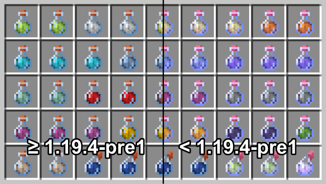

### 精准物品实体模型 (preciseItemEntityModel)

通过以下手段，精准地渲染物品实体的模型：

1. 移除物品的上下悬浮和水平旋转动画

2. 当物品实体包含大于1个物品时，移除额外渲染的那些堆叠模型

3. 调整模型位置和大小，确保模型与物品实体的碰撞箱精确匹配

4. 强制物品模型面向南方。可以通过选项精准物品实体模型-朝向吸附来替代

- 分类: MC修改
- 类型: 带热键布尔值 (工具)
- 默认值: *无快捷键*, `false`

### 精准物品实体模型-朝向吸附 (preciseItemEntityModelYawSnap)

仅在选项精准物品实体模型开启时生效

基于物品实体的朝向，将物品模型朝向往东南西北进行吸附对齐

- 分类: MC修改
- 类型: 布尔值 (通用)
- 默认值: `false`

### 指令补全优先列表 (prioritizedCommandSuggestions)

此列表中的命令建议将在命令补全列表中更靠前

你可以将那些你总是喜欢选择的命令补全放在此列表中

它们将总会位于指令补全列表的首位

- 分类: MC修改
- 类型: 字符串列表 (列表)
- 默认值: `[]`

### 计分板侧边栏缩放 (scoreboardSideBarScale)

将计分板侧边栏按照给定参数进行缩放显示

- 分类: MC修改
- 类型: 实数 (通用)
- 默认值: `1.0`
- 最小值: `0.001`
- 最大值: `2.0`

### 服务端mspt指标统计类型 (serverMsptMetricsStatisticType)

调试界面中服务端mspt指标统计的类型

设置为"游戏刻"以使用原版表现

- 分类: MC修改
- 类型: 带热键选项列表 (列表)
- 默认值: `MSPT (原版)`
- 可用选项: `MSPT (原版)`, `每秒MSPT平均值`, `每秒MSPT最大值`, `每分钟MSPT平均值`, `每分钟MSPT最大值`

### 潜影盒物品内容提示 (shulkerItemContentHint)

在渲染潜影盒物品时，在潜影盒的左下角显示一个盒中内容的提示

若潜影盒仅包含1种物品类型，将显示盒中的那一种物品

若潜影盒包含多种物品类型，将显示“...”

若潜影盒为空，则不显示内容提示

除此之外，若潜影盒非空且非全满，

潜影盒的右下角还会显示一个代表其填充率的容量条

- 分类: MC修改
- 类型: 布尔值 (通用)
- 默认值: `false`

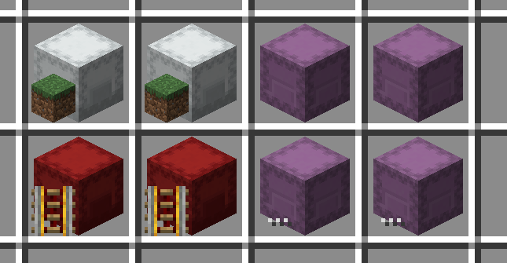

### 潜影盒物品内容提示-缩放 (shulkerItemContentHintScale)

选项潜影盒物品内容提示内容提示的缩放比例

- 分类: MC修改
- 类型: 实数 (通用)
- 默认值: `0.5`
- 最小值: `0.01`
- 最大值: `1.0`

### 潜影盒物品附魔提示 (shulkerTooltipEnchantmentHint)

在潜影盒物品的工具提示中显示物品的附魔

- 分类: MC修改
- 类型: 布尔值 (通用)
- 默认值: `false`

### 潜影盒物品填充率提示 (shulkerTooltipFillLevelHint)

在潜影盒物品工具提示的第一行显示其内容物填充率

- 分类: MC修改
- 类型: 布尔值 (通用)
- 默认值: `false`

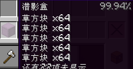

### 潜影盒物品提示长度限制 (shulkerTooltipHintLengthLimit)

在显示潜影盒工具提示中的额外信息时，文本长度的限制

在超出限制时，剩余未显示的信息将被折叠

- 分类: MC修改
- 类型: 整数 (通用)
- 默认值: `120`
- 最小值: `0`
- 最大值: `600`

### 潜影盒物品药水提示 (shulkerTooltipPotionInfoHint)

在潜影盒物品的工具提示中显示物品提供的药水效果

- 分类: MC修改
- 类型: 布尔值 (通用)
- 默认值: `false`

### 告示牌编辑界面取消按钮 (signEditScreenCancelButton)

在标牌编辑界面添加一个取消按钮，用于取消编辑并丢弃所有更改

- 分类: MC修改
- 类型: 布尔值 (通用)
- 默认值: `false`

### 告示牌编辑界面在ESC时丢弃更改 (signEditScreenEscDiscard)

在告示牌编辑界面被ESC键关闭时，丢弃所有更改，还原回编辑前的状态

- 分类: MC修改
- 类型: 布尔值 (通用)
- 默认值: `false`

### 告示牌多行粘贴支持 (signMultilinePasteSupport)

让告示牌编辑界面可以支持

从剪切板一口气粘贴多行文本

- 分类: MC修改
- 类型: 布尔值 (通用)
- 默认值: `false`

### 旁观者传送菜单包含旁观者 (spectatorTeleportMenuIncludeSpectator)

允许旁观者传送菜单列出玩家列表中的旁观者玩家

旁观者玩家将在位于菜单列表的尾部，其玩家名将以灰色斜体的形式显示

- 分类: MC修改
- 类型: 布尔值 (通用)
- 默认值: `false`

### 仅Steve/Alex默认皮肤 (steveAlexOnlyDefaultSkins)

让那些没有自定义皮肤的玩家只使用Steve或Alex作为他们的默认皮肤

这将带回Minecraft 1.19.3版本以前那个经典的只有Steve/Alex皮肤的世界

- 分类: MC修改
- 类型: 布尔值 (通用)
- 默认值: `false`
- 模组约束:
  - 依赖模组:
    - Minecraft (`minecraft`) `>=1.19.3`

### 无限方块实体渲染距离 (unlimitedBlockEntityRenderDistance)

将客户端方块实体渲染距离设置为无限制

影响如箱子、潜影盒、头颅等方块实体

- 分类: MC修改
- 类型: 带热键布尔值 (工具)
- 默认值: *无快捷键*, `false`

### 无限实体渲染距离 (unlimitedEntityRenderDistance)

将客户端实体渲染距离设置为无限制

仍然需要服务器正确地借助EntityTracker发送相关实体数据包

- 分类: MC修改
- 类型: 带热键布尔值 (工具)
- 默认值: *无快捷键*, `false`

### 覆盖世界天气 (weatherOverride)

覆盖客户端中的世界天气

对服务端无影响

- 分类: MC修改
- 类型: 带热键布尔值 (工具)
- 默认值: *无快捷键*, `false`

### 覆盖世界天气种类 (weatherOverrideValue)

用于功能覆盖世界天气的客户端的世界天气种类

- 分类: MC修改
- 类型: 选项列表 (列表)
- 默认值: `晴天`
- 可用选项: `晴天`, `降雨`, `雷暴`

### 禁止服务器IP地址DNS反查 (yeetServerIpReversedDnsLookup)

对于用纯IP表示的服务器地址，阻止其InetAddress对象进行逆向DNS查询操作

很多非本地回环的IP地址并没有对应的域名，这将使逆向查询它们域名的操作消耗不少时间

该选项直接将这些服务器的域名设置为其IP地址，从而跳过不必要的DNS反查操作

取决于具体环境，这能为这类服务器地址带来1s~5s的提速。影响场景：服务器列表刷新、服务器连接

- 分类: MC修改
- 类型: 布尔值 (通用)
- 默认值: `false`

## 模组修改

对模组已有内容修改

### 全局应用TweakerMore选项标签 (applyTweakerMoreOptionLabelGlobally)

将TweakerMore风格的翻译文本+原始文本的选项标签应用到所有使用Malilib的配置界面

- 分类: 模组修改
- 类型: 布尔值 (通用)
- 默认值: `false`

### EasierCrafting与ItemScroller兼容性修复 (eCraftItemScrollerCompact)

修复ItemScroller的部分功能无法与EasierCrafting模组一同工作

例如无法使用的massCraft

- 分类: 模组修改
- 类型: 布尔值 (通用)
- 默认值: `false`
- 模组约束:
  - 依赖模组:
    - EasierCrafting (`easiercrafting`)
    - Item Scroller (`itemscroller`)

### 额外玩家渲染-隐藏于调试界面 (eprHideOnDebugHud)

在调试界面开启（那个按 F3 显示的东西）时，隐藏额外玩家渲染的渲染

- 分类: 模组修改
- 类型: 布尔值 (通用)
- 默认值: `false`
- 模组约束:
  - 依赖模组:
    - ExtraPlayerRenderer (`explayerenderer`)

### 自动补货黑名单 (handRestockBlackList)

不会触发tweakHandRestock的物品

- 分类: 模组修改
- 类型: 字符串列表 (列表)
- 默认值: `[minecraft:lava_bucket]`
- 模组约束:
  - 依赖模组:
    - Tweakeroo (`tweakeroo`)

### 自动补货名单约束类型 (handRestockListType)

tweakHandRestock功能的物品名单约束类型

- 分类: 模组修改
- 类型: 选项列表 (列表)
- 默认值: `None`
- 可用选项: `None`, `Black List`, `White List`
- 模组约束:
  - 依赖模组:
    - Tweakeroo (`tweakeroo`)

### 自动补货白名单 (handRestockWhiteList)

会触发tweakHandRestock的物品

- 分类: 模组修改
- 类型: 字符串列表 (列表)
- 默认值: `[minecraft:bucket]`
- 模组约束:
  - 依赖模组:
    - Tweakeroo (`tweakeroo`)

### Litematica-原点000覆盖 (lmOriginOverride000)

在保存litematica的原理图时，自动将原点设置为[0, 0, 0]

除此之外，一个特殊标记会被储存在.litematica文件里

当一个.litematica文件被加载时，如果检测到了这个特殊标记，

那么这一原理图的将被放置于[0, 0, 0]，而非玩家所在的位置

- 分类: 模组修改
- 类型: 布尔值 (通用)
- 默认值: `false`
- 模组约束:
  - 依赖模组:
    - Litematica (`litematica`)

### Litematica-移除实体指令 (lmRemoveEntityCommand)

修改在litematica删除模式中使用的，用于移除实体的指令

该指令应当能够接受一个实体选择器作为唯一的参数

该选项的生效策略可在选项Litematica-移除实体指令策略中指定

例如，你可以使用Carpet TIS Addition模组的"/removeentity"指令

注意：无需"/"前缀

- 分类: 模组修改
- 类型: 字符串 (通用)
- 默认值: `kill`
- 模组约束:
  - 依赖模组:
    - Litematica (`litematica`)

### Litematica-移除实体指令策略 (lmRemoveEntityCommandPolicy)

选项Litematica-移除实体指令的生效策略

- auto: 仅在给定指令合法时生效（客户端检查）

- always: 总是生效

- 分类: 模组修改
- 类型: 选项列表 (通用)
- 默认值: `自动`
- 可用选项: `自动`, `总是`
- 模组约束:
  - 依赖模组:
    - Litematica (`litematica`)

### MiniHUD-禁用光照显示可刷怪检查 (minihudDisableLightOverlaySpawnCheck)

Mini HUD的光照等级显示仅于可刷怪方块上渲染

该选项移除了这一可刷怪检查，

使得光照等级显示会在任何非空气非流体方块上方的非实体方块处渲染

- 分类: 模组修改
- 类型: 布尔值 (通用)
- 默认值: `false`
- 模组约束:
  - 依赖模组:
    - MiniHUD (`minihud`)

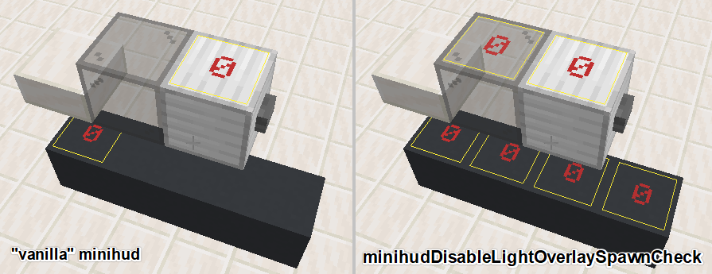

### MiniHUD-隐藏于聊天界面 (minihudHideIfChatScreenOpened)

在聊天界面开启时，隐藏Mini HUD的信息文本渲染

- 分类: 模组修改
- 类型: 布尔值 (通用)
- 默认值: `false`
- 模组约束:
  - 依赖模组:
    - MiniHUD (`minihud`)

### Malilib-潜影盒内容预览支持末影箱 (mlShulkerBoxPreviewSupportEnderChest)

为malilib中的潜影盒预览功能添加对末影箱支持

在多人服务器中，玩家的末影箱数据可以通过选项服务端数据同步器同步至客户端

- 分类: 模组修改
- 类型: 布尔值 (通用)
- 默认值: `false`

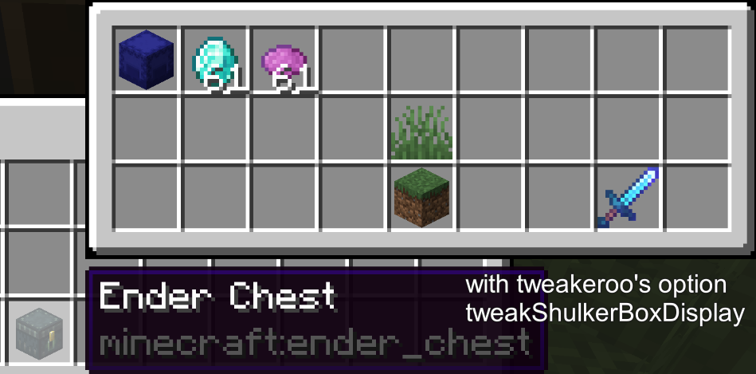

### Optifine-移除展示框物品渲染距离限制 (ofRemoveItemFrameItemRenderDistance)

移除Optifine的展示框物品渲染距离限制

回归原版行为，即展示框的物品总与展示框本身同时渲染

- 分类: 模组修改
- 类型: 布尔值 (通用)
- 默认值: `false`
- 模组约束:
  - 依赖模组:
    - Optifine (`optifabric`)

### Optifine-移除告示牌方块文字渲染距离限制 (ofRemoveSignTextRenderDistance)

移除Optifine的告示牌文字渲染距离限制

回归原版行为，即告示牌的文字总与告示牌同时渲染

- 分类: 模组修改
- 类型: 布尔值 (通用)
- 默认值: `false`
- 模组约束:
  - 依赖模组:
    - Optifine (`optifabric`)

### Optifine-圣诞老人帽子 (ofSantaHat)

在渲染玩家实体时，让玩家戴上Optifine的圣诞老人帽子

那是一个圣诞节期间生效的彩蛋

- 分类: 模组修改
- 类型: 带热键选项列表 (列表)
- 默认值: `不修改`
- 可用选项: `不修改`, `应用于我自己`, `应用于所有人`
- 模组约束:
  - 依赖模组:
    - Optifine (`optifabric`)

### Optifine-解锁F3帧数限制 (ofUnlockF3FpsLimit)

移除F3 HUD显示的10FPS帧数限制

- 分类: 模组修改
- 类型: 布尔值 (通用)
- 默认值: `false`
- 模组约束:
  - 依赖模组:
    - Optifine (`optifabric`)
    - Minecraft (`minecraft`) `>=1.15`

### Optifine-使用原版明亮度缓存 (ofUseVanillaBrightnessCache)

让Optifine在它的LightCacheOF中使用原版的明亮度缓存

平滑光照开启时能提升少许的帧数

- 分类: 模组修改
- 类型: 布尔值 (通用)
- 默认值: `false`
- 模组约束:
  - 依赖模组:
    - Optifine (`optifabric`)

### Optifine-女巫帽子 (ofWitchHat)

在渲染玩家实体时，让玩家戴上Optifine的女巫帽子

那是一个万圣节期间生效的彩蛋

- 分类: 模组修改
- 类型: 带热键选项列表 (列表)
- 默认值: `不修改`
- 可用选项: `不修改`, `应用于我自己`, `应用于所有人`
- 模组约束:
  - 依赖模组:
    - Optifine (`optifabric`)

### Replay-精准时间戳显示 (replayAccurateTimelineTimestamp)

在Replay模组的时间线上显示精确到毫秒的时间戳

- 分类: 模组修改
- 类型: 布尔值 (通用)
- 默认值: `false`
- 模组约束:
  - 依赖模组:
    - Replay mod (`replaymod`)

### Replay-飞行速度上限倍率 (replayFlySpeedLimitMultiplier)

将Replay模组中的相机飞行速度上限乘以给定的值

基本上这是用来提高最大飞行速度的

- 分类: 模组修改
- 类型: 整数 (通用)
- 默认值: `1`
- 最小值: `1`
- 最大值: `30`
- 模组约束:
  - 依赖模组:
    - Replay mod (`replaymod`)

### 服务端数据同步器 (serverDataSyncer)

使用原版数据查询协议从服务器同步实体和方块实体的数据至客户端

在以下操作发生时将进行同步数据：

- Tweakeroo的物品栏预览

- Litematica的原理图保存

- Litematica的方块信息显示

- MiniHUD的蜂巢蜜蜂数量显示

需要玩家拥有服务器的OP权限（权限等级2）才能正常工作

- 分类: 模组修改
- 类型: 带热键布尔值 (工具)
- 默认值: *无快捷键*, `false`
- 模组约束:
  - 依赖模组:
    - Tweakeroo (`tweakeroo`)

  *或*

  - 依赖模组:
    - Litematica (`litematica`)

  *或*

  - 依赖模组:
    - MiniHUD (`minihud`)

### 服务端数据同步器查询间隔 (serverDataSyncerQueryInterval)

服务端数据同步器的查询间隔 (单位:游戏刻)

在使用默认值1时，每游戏刻都会发送一批查询

- 分类: 模组修改
- 类型: 整数 (通用)
- 默认值: `1`
- 最小值: `1`
- 最大值: `100`

### 服务端数据同步器查询数量限制 (serverDataSyncerQueryLimit)

服务端数据同步器每游戏刻中发送的查询数量上限

超出数量上限的查询将被延迟发送

- 分类: 模组修改
- 类型: 整数 (通用)
- 默认值: `512`
- 最小值: `1`
- 最大值: `8192`

### 光影使用游戏时间作为世界时间 (shaderGameTimeAsWorldTime)

使用游戏时间作为Optifine/Iris光影的"worldTime"uniform变量

因此在游戏规则doDaylightCycle关闭的情况下这一变量仍能递增

- 分类: 模组修改
- 类型: 布尔值 (通用)
- 默认值: `false`
- 模组约束:
  - 依赖模组:
    - Optifine (`optifabric`)

  *或*

  - 依赖模组:
    - Iris (`iris`)

### xaero世界地图-跳过会话结束等待 (xmapNoSessionFinalizationWait)

退出一个世界时跳过xaero worldmap的会话结束逻辑

因此在退出服务器或单人游戏时不会出现卡顿

不过可能会有一些副作用，但暂时没发现

- 分类: 模组修改
- 类型: 布尔值 (通用)
- 默认值: `false`
- 模组约束:
  - 依赖模组:
    - Xaero's World Map (`xaeroworldmap`)

### xaero小地图-Freecam兼容 (xmapWaypointFreecamCompact)

在tweakeroo的freecam开启时，让xaero小地图的游戏内路径点正确地渲染

- 分类: 模组修改
- 类型: 布尔值 (通用)
- 默认值: `false`
- 模组约束:
  - 依赖模组:
    - Tweakeroo (`tweakeroo`)
    - Xaero's Minimap (`xaerominimap`)

  *或*

  - 依赖模组:
    - Tweakeroo (`tweakeroo`)
    - Better PVP Mod (`xaerobetterpvp`)

## 移植

从其他Minecraft版本中移植的原版或模组功能

### ItemScroller移动整组物品备用操作修复-移植 (isScrollStacksFallbackFixPorting)

修复ItemScroller的SCROLL_STACKS_FALLBACK未考虑最后一组物品

同masa在itemscroller的修复commit 0984fe7相同

- 分类: 移植
- 类型: 布尔值 (修复)
- 默认值: `false`
- 模组约束:
  - 依赖模组:
    - Item Scroller (`itemscroller`)
    - Minecraft (`minecraft`) `<1.18`

### Litematica自定义原理图根文件夹开关-移植 (lmCustomSchematicBaseDirectoryEnabledPorting)

从Litematica 0.9.0 mc1.17+移植customSchematicBaseDirectoryEnabled

- 分类: 移植
- 类型: 布尔值 (通用)
- 默认值: `false`
- 模组约束:
  - 依赖模组:
    - Litematica (`litematica`)
    - Minecraft (`minecraft`) `<1.17`

### Litematica自定义原理图根文件夹路径-移植 (lmCustomSchematicBaseDirectoryPorting)

从Litematica 0.9.0 mc1.17+移植lmCustomSchematicBaseDirectoryPorting

- 分类: 移植
- 类型: 字符串 (通用)
- 默认值: `D:\Codes\Minecraft\[Mod]\tweakermore\run\schematics`
- 模组约束:
  - 依赖模组:
    - Litematica (`litematica`)
    - Minecraft (`minecraft`) `<1.17`

### Litematica选择含目标物潜影盒-移植 (lmPickBlockShulkersPorting)

从Litematica mc1.16+移植pickBlockShulkers

- 分类: 移植
- 类型: 布尔值 (通用)
- 默认值: `false`
- 模组约束:
  - 依赖模组:
    - Litematica (`litematica`)
    - Minecraft (`minecraft`) `<1.16`

### Minecraft旁观者切换时下移修复-移植 (mcSpectatorEnterSinkingFixPorting)

对MC-146582的修复，移植自mc1.20

修复了玩家站在地面上切换旁观者模式后出现的意料外下移

- 分类: 移植
- 类型: 布尔值 (通用)
- 默认值: `false`
- 模组约束:
  - 依赖模组:
    - Minecraft (`minecraft`) `<1.20`

### Tweakeroo禁用扭曲效果-移植 (tkrDisableNauseaEffectPorting)

从Tweakeroo mc1.17+移植disableNauseaEffect

同时修复了玩家在接触地狱门时，地狱门材质覆盖无法显示的问题

- 分类: 移植
- 类型: 带热键布尔值 (禁用)
- 默认值: *无快捷键*, `false`
- 模组约束:
  - 依赖模组:
    - Minecraft (`minecraft`) `<1.17`

## 配置

与TweakerMore相关的配置

### 选项原名缩放 (configOriginalNameScale)

配置界面中，选项原始文本的缩放比例

- 分类: 配置
- 类型: 实数 (通用)
- 默认值: `0.65`
- 最小值: `0.0`
- 最大值: `1.0`

### 隐藏禁用的选项 (hideDisabledOptions)

在配置界面中隐藏因模组约束关系不被满足而被禁用的选项

- 分类: 配置
- 类型: 布尔值 (通用)
- 默认值: `false`

### 打开TweakerMore配置界面 (openTweakerMoreConfigGui)

打开TweakerMore的配置界面

- 分类: 配置
- 类型: 热键 (热键)
- 默认值: `K,C`

### 保留配置文件中的未知条目 (preserveConfigUnknownEntries)

在TweakerMore的配置文件中保留未知的配置条目

如果设置为false，未知的条目将于配置文件被写入时被删除

- 分类: 配置
- 类型: 布尔值 (通用)
- 默认值: `true`

### TweakerMore调试模式 (tweakerMoreDebugMode)

TweakerMore的调试模式

当启用时，调试用参数选项以及当前游戏版本不支持的选项会被显示

以及调试相关的功能会被启用

- 分类: 配置
- 类型: 带热键布尔值 (工具)
- 默认值: *无快捷键*, `false`

