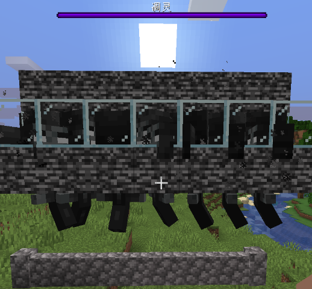
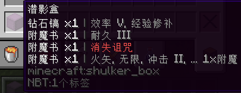
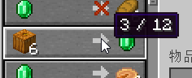
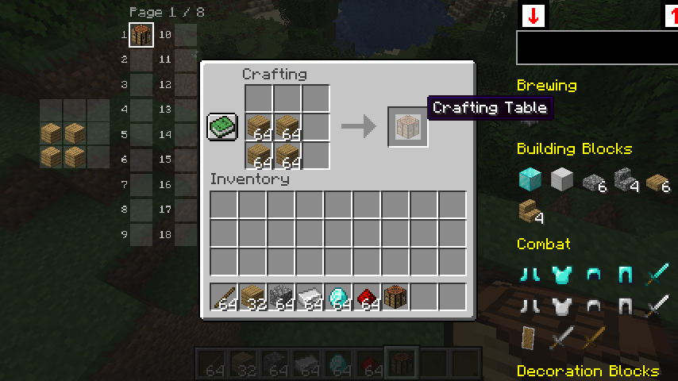
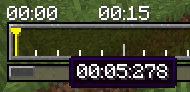

## 功能

### 自动填充容器阈值 (autoFillContainerThreshold)

触发功能tweakmAutoFillContainer所需要的最小的物品槽位数

例如，如果你总是带着2个格子的烟花火箭，那么你可以将其设置为3，

那么这些烟花物品将必定不会被用于填充容器

- 分类: 功能
- 类型: 整数
- 默认值: `2`
- 最小值: `1`
- 最大值: `36`

### Boss栏最大条目数 (bossBarMaxEntry)

修改最大同时显示的Boss栏条目数量

它也会跳过原版的 窗口高度/3 限制检查

将其设置为-1以禁用 (沿用原版逻辑)

- 分类: 功能
- 类型: 整数
- 默认值: `-1`
- 最小值: `-1`
- 最大值: `20`

### Boss栏缩放 (bossBarScale)

将Boss栏按照给定参数进行缩放显示

- 分类: 功能
- 类型: 实数
- 默认值: `1.0`
- 最小值: `0.001`
- 最大值: `2.0`

### 聊天信息数量上限 (chatMessageLimit)

修改聊天栏的历史信息储存数量上限

- 分类: 功能
- 类型: 整数
- 默认值: `100`
- 最小值: `100`
- 最大值: `10000`
- 模组约束:
  - 冲突模组:
    - `raise-chat-limit`

### 网络连接延迟模拟 (connectionSimulatedDelay)

客户端网络延迟模拟器，于给定值大于0时启用

在任何数据包处理前插入给定的延迟 (单位毫秒)

可以认为它会稳定地将你的网络延迟ping值增加给定的值

- 分类: 功能
- 类型: 整数
- 默认值: `0`
- 最小值: `0`
- 最大值: `15000`

### 复制告示牌文本 (copySignTextToClipBoard)

将玩家指向的告示牌中的文本复制到剪贴板

- 分类: 功能
- 类型: 热键
- 默认值: *无快捷键*

### 禁用相机视锥体渲染剔除 (disableCameraFrustumCulling)

禁用基于相机视锥体的渲染剔除，即玩家视野范围外的画面也会被渲染

方块和实体的渲染均受影响

常用于保证光影下阴影的完整性等

对帧数有明显影响

- 分类: 功能
- 类型: 可开关型热键
- 默认值: *无快捷键*, `false`

### 禁用光照更新 (disableLightUpdates)

禁用客户端光照更新

- 分类: 功能
- 类型: 可开关型热键
- 默认值: *无快捷键*, `false`

### 禁用活塞方块破坏粒子效果 (disablePistonBlockBreakingParticle)

移除活塞破坏方块时生成的粒子效果

- 分类: 功能
- 类型: 可开关型热键
- 默认值: *无快捷键*, `false`
- 模组约束:
  - 依赖模组:
    - `minecraft >=1.17`

### 禁用红石粉粒子效果 (disableRedstoneWireParticle)

禁用红石粉发出的粒子效果

- 分类: 功能
- 类型: 可开关型热键
- 默认值: *无快捷键*, `false`

### 自动补货黑名单 (handRestockBlackList)

不会触发tweakHandRestock的物品

- 分类: 功能
- 类型: 字符串列表
- 默认值: `[minecraft:lava_bucket]`
- 模组约束:
  - 依赖模组:
    - `tweakeroo`

### 自动补货名单约束类型 (handRestockListType)

tweakHandRestock功能的物品名单约束类型

- 分类: 功能
- 类型: 选项列表
- 默认值: `none`
- 可用选项: `None`, `Black List`
- 模组约束:
  - 依赖模组:
    - `tweakeroo`

### 自动补货白名单 (handRestockWhiteList)

会触发tweakHandRestock的物品

- 分类: 功能
- 类型: 字符串列表
- 默认值: `[minecraft:bucket]`
- 模组约束:
  - 依赖模组:
    - `tweakeroo`

### 旧版F3+N逻辑 (legacyF3NLogic)

修改快捷键F3+N的逻辑至1.15及之前的逻辑

提示，1.15以前的逻辑为：创造模式->旁观者模式、其他模式->创造模式

- 分类: 功能
- 类型: 布尔值
- 默认值: `false`
- 模组约束:
  - 依赖模组:
    - `minecraft >=1.16`

### 最大聊天界面高度 (maxChatHudHeight)

聊天界面高度的最大值

- 分类: 功能
- 类型: 整数
- 默认值: `160`
- 最小值: `160`
- 最大值: `1000`

### 地狱门音效概率 (netherPortalSoundChance)

地狱门方块播放音效的概率

将其设为0.001或0.0001来让地狱门没那么吵

- 分类: 功能
- 类型: 实数
- 默认值: `0.01`
- 最小值: `0.0`
- 最大值: `0.01`

### 指令补全优先列表 (prioritizedCommandSuggestions)

此列表中的命令建议将在命令补全列表中更靠前

你可以将那些你总是喜欢选择的命令补全放在此列表中

它们将总会位于指令补全列表的首位

- 分类: 功能
- 类型: 字符串列表
- 默认值: `[]`

### 刷新物品栏 (refreshInventory)

向服务端请求一次玩家物品栏刷新

它将模拟一次无效的物品栏拖动操作，

让服务器认为玩家的物品栏已失去同步并刷新玩家物品栏

- 分类: 功能
- 类型: 热键
- 默认值: *无快捷键*

### 安全挂机血量阈值 (safeAfkHealthThreshold)

触发安全挂机功能的玩家的血量阈值

当玩家受到伤害且血量小于给定值时断开连接

- 分类: 功能
- 类型: 实数
- 默认值: `10.0`
- 最小值: `0.0`
- 最大值: `100.0`

### 计分板侧边栏缩放 (scoreboardSideBarScale)

将计分板侧边栏按照给定参数进行缩放显示

- 分类: 功能
- 类型: 实数
- 默认值: `1.0`
- 最小值: `0.001`
- 最大值: `2.0`

### 潜影盒物品显示提示附魔 (shulkerTooltipEnchantmentHint)

在潜影盒物品的工具提示中显示物品的附魔

- 分类: 功能
- 类型: 布尔值
- 默认值: `false`

### 自动清空容器 (tweakmAutoCleanContainer)

打开容器后，自动将容器内的所有物品扔出

然后关闭容器

- 分类: 功能
- 类型: 可开关型热键
- 默认值: *无快捷键*, `false`
- 模组约束:
  - 依赖模组:
    - `itemscroller`

### 自动装填容器 (tweakmAutoFillContainer)

打开容器后，自动使用物品栏中占用格子数最多的物品装填容器

当且仅当占用格子数最多的物品是唯一的

然后关闭容器

- 分类: 功能
- 类型: 可开关型热键
- 默认值: *无快捷键*, `false`
- 模组约束:
  - 依赖模组:
    - `itemscroller`

### 自动选择原理图方块 (tweakmAutoPickSchematicBlock)

在放置方块前自动选择原理图中的方块对应的物品

逻辑同litematica mod的pickBlock功能，你需要在litematica mod中启用pickBlockEnabled选项

在轻松放置开启时无效

- 分类: 功能
- 类型: 可开关型热键
- 默认值: *无快捷键*, `false`
- 模组约束:
  - 依赖模组:
    - `tweakeroo`
    - `litematica`

### 无瑕世界渲染 (tweakmFlawlessFrames)

强制客户端渲染世界时每一帧都更新完毕所有已加载区块中的变化

借用了Replay模组渲染各种任务时所使用的逻辑

警告：这可能会让客户端频繁地卡顿

- 分类: 功能
- 类型: 可开关型热键
- 默认值: *无快捷键*, `false`
- 模组约束:
  - 依赖模组:
    - `replaymod`

### 安全挂机 (tweakmSafeAfk)

在受到伤害时断开连接

触发断开连接的玩家血量阈值可以在safeAfkHealthThreshold中设置

- 分类: 功能
- 类型: 可开关型热键
- 默认值: *无快捷键*, `false`

### 无限实体渲染距离 (tweakmUnlimitedEntityRenderDistance)

将客户端实体渲染距离设置为无限制

仍然需要服务器正确地借助EntityTracker发送相关实体数据包

- 分类: 功能
- 类型: 可开关型热键
- 默认值: *无快捷键*, `false`

### 村民交易次数显示 (villagerOfferUsesDisplay)

在村民交易列表中显示当前交易的次数以及上限

将指针移至交易的箭头上来以显示

- 分类: 功能
- 类型: 布尔值
- 默认值: `false`

## 模组修改

### 全局应用TweakerMore选项标签 (applyTweakerMoreOptionLabelGlobally)

将TweakerMore风格的翻译文本+原始文本的选项标签应用到所有使用Malilib的配置界面

- 分类: 模组修改
- 类型: 布尔值
- 默认值: `false`

### EasierCrafting与ItemScroller兼容性修复 (eCraftItemScrollerCompact)

修复ItemScroller的部分功能无法与EasierCrafting模组一同工作

例如无法使用的massCraft

- 分类: 模组修改
- 类型: 布尔值
- 默认值: `false`
- 模组约束:
  - 依赖模组:
    - `easiercrafting`
    - `itemscroller`

### Optifine移除告示牌方块文字渲染距离限制 (ofRemoveSignTextRenderDistance)

移除Optifine的告示牌文字渲染距离限制

回归原版行为，即告示牌的文字总与告示牌同时渲染

- 分类: 模组修改
- 类型: 布尔值
- 默认值: `false`
- 模组约束:
  - 依赖模组:
    - `optifabric`

### Optifine解锁F3帧数限制 (ofUnlockF3FpsLimit)

移除F3 HUD显示的10FPS帧数限制

- 分类: 模组修改
- 类型: 布尔值
- 默认值: `false`
- 模组约束:
  - 依赖模组:
    - `optifabric`
    - `minecraft >=1.15`

### Replay精准时间戳显示 (replayAccurateTimelineTimestamp)

在Replay模组的时间线上显示精确到毫秒的时间戳

- 分类: 模组修改
- 类型: 布尔值
- 默认值: `false`
- 模组约束:
  - 依赖模组:
    - `replaymod`

### Replay飞行速度上限倍率 (replayFlySpeedLimitMultiplier)

将Replay模组中的相机飞行速度上限乘以给定的值

基本上这是用来提高最大飞行速度的

- 分类: 模组修改
- 类型: 整数
- 默认值: `1`
- 最小值: `1`
- 最大值: `30`
- 模组约束:
  - 依赖模组:
    - `replaymod`

### 光影使用游戏时间作为世界时间 (shaderGameTimeAsWorldTime)

使用游戏时间作为Optifine/Iris光影的"worldTime"uniform变量

因此在游戏规则doDaylightCycle关闭的情况下这一变量仍能递增

- 分类: 模组修改
- 类型: 布尔值
- 默认值: `false`
- 模组约束:
  - 依赖模组:
    - `optifabric`

  *或*

  - 依赖模组:
    - `iris`

### xaero世界地图跳过会话结束等待 (xmapNoSessionFinalizationWait)

退出一个世界时跳过xaero worldmap的会话结束逻辑

因此在退出服务器或单人游戏时不会出现卡顿

不过可能会有一些副作用，但暂时没发现

- 分类: 模组修改
- 类型: 布尔值
- 默认值: `false`
- 模组约束:
  - 依赖模组:
    - `xaeroworldmap`

## 配置

### 隐藏禁用的选项 (hideDisabledOptions)

在配置界面中隐藏因模组约束关系不被满足而被禁用的选项

- 分类: 配置
- 类型: 布尔值
- 默认值: `false`

### 打开TweakerMore配置界面 (openTweakerMoreConfigGui)

打开TweakerMore的配置界面

- 分类: 配置
- 类型: 热键
- 默认值: `K,C`

### 保留配置文件中的未知条目 (preserveConfigUnknownEntries)

在TweakerMore的配置文件中保留未知的配置条目

如果设置为false，未知的条目将于配置文件被写入时被删除

- 分类: 配置
- 类型: 布尔值
- 默认值: `true`

### TweakerMore调试模式 (tweakerMoreDebugMode)

TweakerMore的调试模式

当启用时，调试用参数选项以及当前游戏版本不支持的选项会被显示

以及调试相关的功能会被启用

- 分类: 配置
- 类型: 可开关型热键
- 默认值: *无快捷键*, `false`

