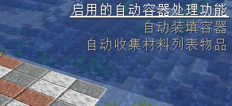
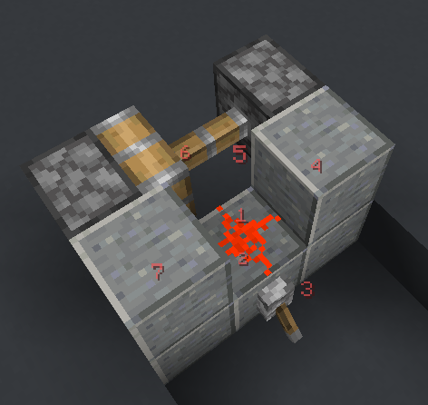

## 功能

TweakerMore提供的新功能

### 自动装填容器阈值 (autoFillContainerThreshold)

触发功能tweakmAutoFillContainer所需要的最小的物品槽位数

例如，如果你总是带着2个格子的烟花火箭，那么你可以将其设置为3，

那么这些烟花物品将必定不会被用于填充容器

- 分类: 功能
- 类型: 整数
- 默认值: `2`
- 最小值: `1`
- 最大值: `36`

### 复制告示牌文本 (copySignTextToClipBoard)

将玩家指向的告示牌中的文本复制到剪贴板

- 分类: 功能
- 类型: 热键
- 默认值: *无快捷键*

### 红石粉更新顺序文本透明度 (redstoneDustUpdateOrderTextAlpha)

用于渲染红石粉方块更新顺序文本的透明度

参见选项tweakmShowRedstoneDustUpdateOrder

- 分类: 功能
- 类型: 实数
- 默认值: `0.6`
- 最小值: `0.0`
- 最大值: `1.0`

### 刷新物品栏 (refreshInventory)

向服务端请求一次玩家物品栏刷新

它将模拟一次无效的物品栏拖动操作，

让服务器认为玩家的物品栏已失去同步并刷新玩家物品栏

- 分类: 功能
- 类型: 热键
- 默认值: *无快捷键*

### 安全挂机血量阈值 (safeAfkHealthThreshold)

触发安全挂机功能的玩家的血量阈值

当玩家受到伤害且血量小于给定值时断开连接

- 分类: 功能
- 类型: 实数
- 默认值: `10.0`
- 最小值: `0.0`
- 最大值: `100.0`

### 自动清空容器 (tweakmAutoCleanContainer)

打开容器后，自动将容器内的所有物品扔出

然后关闭容器

- 分类: 功能
- 类型: 可开关型热键
- 默认值: *无快捷键*, `false`
- 模组约束:
  - 依赖模组:
    - Item Scroller (`itemscroller`)

### 自动清空容器-黑名单 (tweakmAutoCleanContainerBlackList)

使用自动清空容器功能时不会从容器里中扔出的物品类型

- 分类: 功能
- 类型: 字符串列表
- 默认值: `[minecraft:shulker_box]`
- 模组约束:
  - 依赖模组:
    - Item Scroller (`itemscroller`)

### 自动清空容器-名单约束类型 (tweakmAutoCleanContainerListType)

触发自动清空容器功能的物品名单约束类型

- 分类: 功能
- 类型: 选项列表
- 默认值: `None`
- 可用选项: `None`, `Black List`, `White List`
- 模组约束:
  - 依赖模组:
    - Item Scroller (`itemscroller`)

### 自动清空容器-白名单 (tweakmAutoCleanContainerWhiteList)

使用自动清空容器功能时从容器里中扔出的物品类型

- 分类: 功能
- 类型: 字符串列表
- 默认值: `[minecraft:shulker_box]`
- 模组约束:
  - 依赖模组:
    - Item Scroller (`itemscroller`)

### 自动收集材料列表物品 (tweakmAutoCollectMaterialListItem)

打开容器后，自动收集litematica材料列表中缺失的物品至玩家物品栏

然后关闭容器

- 分类: 功能
- 类型: 可开关型热键
- 默认值: *无快捷键*, `false`
- 模组约束:
  - 依赖模组:
    - Litematica (`litematica`)
    - Item Scroller (`itemscroller`)

### 自动装填容器 (tweakmAutoFillContainer)

打开容器后，自动使用物品栏中占用格子数最多的物品装填容器

当且仅当占用格子数最多的物品是唯一的

然后关闭容器

- 分类: 功能
- 类型: 可开关型热键
- 默认值: *无快捷键*, `false`
- 模组约束:
  - 依赖模组:
    - Item Scroller (`itemscroller`)

### 自动选择原理图方块 (tweakmAutoPickSchematicBlock)

在放置方块前自动选择原理图中的方块对应的物品

逻辑同litematica模组的pickBlock功能，你需要在litematica mod中启用pickBlockEnabled选项

在轻松放置开启时无效

- 分类: 功能
- 类型: 可开关型热键
- 默认值: *无快捷键*, `false`
- 模组约束:
  - 依赖模组:
    - Tweakeroo (`tweakeroo`)
    - Litematica (`litematica`)

### 自动放回已存在的物品 (tweakmAutoPutBackExistedItem)

自动将在容器中也存在的背包物品放回容器中

然后关闭容器

- 分类: 功能
- 类型: 可开关型热键
- 默认值: *无快捷键*, `false`
- 模组约束:
  - 依赖模组:
    - Item Scroller (`itemscroller`)

### 自动容器处理提示 (tweakmContainerProcessorHint)

在界面右上角显示自动容器处理相关功能的开启情况，包括：

- 自动清空容器 (tweakmAutoCleanContainer)

- 自动装填容器 (tweakmAutoFillContainer)

- 自动放回已存在的物品 (tweakmAutoPutBackExistedItem)

- 自动收集材料列表物品 (tweakmAutoCollectMaterialListItem)

- 分类: 功能
- 类型: 可开关型热键
- 默认值: *无快捷键*, `false`

### 自动容器处理提示-位置 (tweakmContainerProcessorHintPos)

自动容器处理提示渲染时所用的显示位置

- 分类: 功能
- 类型: 选项列表
- 默认值: `Top Right`
- 可用选项: `Top Left`, `Top Right`, `Bottom Left`, `Bottom Right`, `Center`

### 自动容器处理提示-字体大小 (tweakmContainerProcessorHintScale)

自动容器处理提示渲染时所用的字体相对大小

- 分类: 功能
- 类型: 实数
- 默认值: `1.0`
- 最小值: `0.25`
- 最大值: `4.0`

### 安全挂机 (tweakmSafeAfk)

在受到伤害时断开连接

触发断开连接的玩家血量阈值可以在safeAfkHealthThreshold中设置

- 分类: 功能
- 类型: 可开关型热键
- 默认值: *无快捷键*, `false`

### 显示红石粉更新顺序 (tweakmShowRedstoneDustUpdateOrder)

在指向红石粉方块时，显示其方块更新顺序

- 分类: 功能
- 类型: 可开关型热键
- 默认值: *无快捷键*, `false`

### 村民交易次数显示 (villagerOfferUsesDisplay)

在村民交易列表中显示当前交易的次数以及上限

将指针移至交易的箭头上来以显示

- 分类: 功能
- 类型: 布尔值
- 默认值: `false`

## MC修改

对Minecraft已有内容修改

### Boss栏最大条目数 (bossBarMaxEntry)

修改最大同时显示的Boss栏条目数量

它也会跳过原版的 窗口高度/3 限制检查

将其设置为-1以禁用 (沿用原版逻辑)

- 分类: MC修改
- 类型: 整数
- 默认值: `-1`
- 最小值: `-1`
- 最大值: `20`

### Boss栏缩放 (bossBarScale)

将Boss栏按照给定参数进行缩放显示

- 分类: MC修改
- 类型: 实数
- 默认值: `1.0`
- 最小值: `0.001`
- 最大值: `2.0`

### 聊天信息数量上限 (chatMessageLimit)

修改聊天栏的历史信息储存数量上限

- 分类: MC修改
- 类型: 整数
- 默认值: `100`
- 最小值: `100`
- 最大值: `10000`
- 模组约束:
  - 冲突模组:
    - CompactChat (`compactchat`)
    - MoreChatHistory (`morechathistory`)
    - Parachute (`parachute`)
    - Raise Chat Limit (`raise-chat-limit`)
    - Where's My Chat History (`wmch`)

### 网络连接延迟模拟 (connectionSimulatedDelay)

客户端网络延迟模拟器，于给定值大于0时启用

在任何数据包处理前插入给定的延迟 (单位毫秒)

可以认为它会稳定地将你的网络延迟ping值增加给定的值

- 分类: MC修改
- 类型: 整数
- 默认值: `0`
- 最小值: `0`
- 最大值: `15000`

### 覆盖世界时间数值 (daytimeOverrideValue)

用于功能tweakmDaytimeOverride的客户端的世界时间数值

- 分类: MC修改
- 类型: 整数
- 默认值: `0`
- 最小值: `0`
- 最大值: `24000`

### 禁用信标光柱渲染 (disableBeaconBeamRendering)

阻止游戏渲染信标光柱

这样信标光柱就不会在你录像或渲染的时候突然出现

- 分类: MC修改
- 类型: 可开关型热键
- 默认值: *无快捷键*, `false`

### 禁用相机视锥体渲染剔除 (disableCameraFrustumCulling)

禁用基于相机视锥体的渲染剔除，即玩家视野范围外的画面也会被渲染

方块和实体的渲染均受影响

常用于保证光影下阴影的完整性等

对帧数有明显影响

- 分类: MC修改
- 类型: 可开关型热键
- 默认值: *无快捷键*, `false`

### 禁用相机浸没迷雾 (disableCameraSubmersionFog)

禁用由于相机浸没在方块或流体中，包括水、熔岩和粉雪，而造成的迷雾效果

它将使用渲染距离的雾将被使用，就像相机在空气中一样

- 分类: MC修改
- 类型: 可开关型热键
- 默认值: *无快捷键*, `false`

### 禁用创造模式飞行攀爬 (disableCreativeFlyClimbingCheck)

阻止创造模式玩家在飞行时进入"在梯子上攀爬"的状态，

这样玩家的飞行移动就能不受梯子等方块的影响

- 分类: MC修改
- 类型: 可开关型热键
- 默认值: *无快捷键*, `false`

### 禁用光照更新 (disableLightUpdates)

禁用客户端光照更新

- 分类: MC修改
- 类型: 可开关型热键
- 默认值: *无快捷键*, `false`

### 禁用活塞方块破坏粒子效果 (disablePistonBlockBreakingParticle)

移除活塞破坏方块时生成的粒子效果

- 分类: MC修改
- 类型: 可开关型热键
- 默认值: *无快捷键*, `false`
- 模组约束:
  - 依赖模组:
    - Minecraft (`minecraft`) ` >=1.17`

### 禁用红石粒子效果 (disableRedstoneParticle)

禁用所有的红石粒子效果

即来自红石粉、红石火把、红石中继器等的粒子效果

- 分类: MC修改
- 类型: 可开关型热键
- 默认值: *无快捷键*, `false`

### 禁用告示牌文本长度限制 (disableSignTextLengthLimit)

禁用在编辑或渲染告示牌时，告示牌基于字符长度的文本长度限制

在编辑告示牌过程中，超出限制长度时，文本左侧会显示红色感叹号

- 分类: MC修改
- 类型: 可开关型热键
- 默认值: *无快捷键*, `false`

### 修复箱子镜像变换 (fixChestMirroring)

修复箱子方块在进行镜像变换时没有正确地处理其chest_type属性

对使用了原版方块镜像逻辑的功能有效，包括原版结构放置、litematica mod的原理图放置

- 分类: MC修改
- 类型: 布尔值
- 默认值: `false`

### 玩家飞行阻力 (flyDrag)

覆盖玩家在创造模式或旁观模式下的飞行阻力因子

在该选项被修改时，fabric-carpet规则creativeFlyDrag的效果将被覆盖

- 分类: MC修改
- 类型: 实数
- 默认值: `0.09`
- 最小值: `0.0`
- 最大值: `1.0`

### 旧版F3+N逻辑 (legacyF3NLogic)

修改快捷键F3+N的逻辑至1.15及之前的逻辑

提示，1.15以前的逻辑为：创造模式->旁观者模式、其他模式->创造模式

- 分类: MC修改
- 类型: 布尔值
- 默认值: `false`
- 模组约束:
  - 依赖模组:
    - Minecraft (`minecraft`) ` >=1.16`

### 最大聊天界面高度 (maxChatHudHeight)

聊天界面高度的最大值

- 分类: MC修改
- 类型: 整数
- 默认值: `160`
- 最小值: `160`
- 最大值: `1000`

### 地狱门音效概率 (netherPortalSoundChance)

地狱门方块播放音效的概率

将其设为0.001或0.0001来让地狱门没那么吵

- 分类: MC修改
- 类型: 实数
- 默认值: `0.01`
- 最小值: `0.0`
- 最大值: `0.01`

### 指令补全优先列表 (prioritizedCommandSuggestions)

此列表中的命令建议将在命令补全列表中更靠前

你可以将那些你总是喜欢选择的命令补全放在此列表中

它们将总会位于指令补全列表的首位

- 分类: MC修改
- 类型: 字符串列表
- 默认值: `[]`

### 计分板侧边栏缩放 (scoreboardSideBarScale)

将计分板侧边栏按照给定参数进行缩放显示

- 分类: MC修改
- 类型: 实数
- 默认值: `1.0`
- 最小值: `0.001`
- 最大值: `2.0`

### 潜影盒物品附魔提示 (shulkerTooltipEnchantmentHint)

在潜影盒物品的工具提示中显示物品的附魔

- 分类: MC修改
- 类型: 布尔值
- 默认值: `false`

### 潜影盒物品填充率提示 (shulkerTooltipFillLevelHint)

在潜影盒物品工具提示的第一行显示其内容物填充率

- 分类: MC修改
- 类型: 布尔值
- 默认值: `false`

### 潜影盒物品提示长度限制 (shulkerTooltipHintLengthLimit)

在显示潜影盒工具提示中的额外信息时，文本长度的限制

在超出限制时，剩余未显示的信息将被折叠

- 分类: MC修改
- 类型: 整数
- 默认值: `120`
- 最小值: `0`
- 最大值: `600`

### 潜影盒物品药水提示 (shulkerTooltipPotionInfoHint)

在潜影盒物品的工具提示中显示物品提供的药水效果

- 分类: MC修改
- 类型: 布尔值
- 默认值: `false`

### 旁观者传送菜单包含旁观者 (spectatorTeleportMenuIncludeSpectator)

允许旁观者传送菜单列出玩家列表中的旁观者玩家

旁观者玩家将在位于菜单列表的尾部，其玩家名将以灰色斜体的形式显示

- 分类: MC修改
- 类型: 布尔值
- 默认值: `false`

### 覆盖世界时间 (tweakmDaytimeOverride)

覆盖客户端中的世界时间

对服务端无影响

- 分类: MC修改
- 类型: 可开关型热键
- 默认值: *无快捷键*, `false`

### 伪夜视 (tweakmFakeNightVision)

总是运用夜视效果下的游戏渲染，无论玩家是否确实拥有夜视效果

- 分类: MC修改
- 类型: 可开关型热键
- 默认值: *无快捷键*, `false`

### 无瑕世界渲染 (tweakmFlawlessFrames)

强制客户端渲染世界时每一帧都更新完毕所有已加载区块中的变化

借用了Replay模组渲染各种任务时所使用的逻辑

警告：这可能会让客户端频繁地卡顿

- 分类: MC修改
- 类型: 可开关型热键
- 默认值: *无快捷键*, `false`
- 模组约束:
  - 依赖模组:
    - Replay mod (`replaymod`)

### 无限实体渲染距离 (tweakmUnlimitedEntityRenderDistance)

将客户端实体渲染距离设置为无限制

仍然需要服务器正确地借助EntityTracker发送相关实体数据包

- 分类: MC修改
- 类型: 可开关型热键
- 默认值: *无快捷键*, `false`

### 覆盖世界天气 (tweakmWeatherOverride)

覆盖客户端中的世界天气

对服务端无影响

- 分类: MC修改
- 类型: 可开关型热键
- 默认值: *无快捷键*, `false`

### 覆盖世界天气种类 (weatherOverrideValue)

用于功能tweakmWeatherOverride的客户端的世界天气种类

- 分类: MC修改
- 类型: 选项列表
- 默认值: `晴天`
- 可用选项: `晴天`, `降雨`, `雷暴`

## 模组修改

对模组已有内容修改

### 全局应用TweakerMore选项标签 (applyTweakerMoreOptionLabelGlobally)

将TweakerMore风格的翻译文本+原始文本的选项标签应用到所有使用Malilib的配置界面

- 分类: 模组修改
- 类型: 布尔值
- 默认值: `false`

### EasierCrafting与ItemScroller兼容性修复 (eCraftItemScrollerCompact)

修复ItemScroller的部分功能无法与EasierCrafting模组一同工作

例如无法使用的massCraft

- 分类: 模组修改
- 类型: 布尔值
- 默认值: `false`
- 模组约束:
  - 依赖模组:
    - EasierCrafting (`easiercrafting`)
    - Item Scroller (`itemscroller`)

### 自动补货黑名单 (handRestockBlackList)

不会触发tweakHandRestock的物品

- 分类: 模组修改
- 类型: 字符串列表
- 默认值: `[minecraft:lava_bucket]`
- 模组约束:
  - 依赖模组:
    - Tweakeroo (`tweakeroo`)

### 自动补货名单约束类型 (handRestockListType)

tweakHandRestock功能的物品名单约束类型

- 分类: 模组修改
- 类型: 选项列表
- 默认值: `None`
- 可用选项: `None`, `Black List`, `White List`
- 模组约束:
  - 依赖模组:
    - Tweakeroo (`tweakeroo`)

### 自动补货白名单 (handRestockWhiteList)

会触发tweakHandRestock的物品

- 分类: 模组修改
- 类型: 字符串列表
- 默认值: `[minecraft:bucket]`
- 模组约束:
  - 依赖模组:
    - Tweakeroo (`tweakeroo`)

### MiniHUD禁用光照显示可刷怪检查 (minihudDisableLightOverlaySpawnCheck)

Mini HUD的光照等级显示仅于可刷怪方块上渲染

该选项移除了这一可刷怪检查，

使得光照等级显示会在任何非空气非流体方块上方的非实体方块处渲染

- 分类: 模组修改
- 类型: 布尔值
- 默认值: `false`
- 模组约束:
  - 依赖模组:
    - MiniHUD (`minihud`)

### Optifine移除展示框物品渲染距离限制 (ofRemoveItemFrameItemRenderDistance)

移除Optifine的展示框物品渲染距离限制

回归原版行为，即展示框的物品总与展示框本身同时渲染

- 分类: 模组修改
- 类型: 布尔值
- 默认值: `false`
- 模组约束:
  - 依赖模组:
    - Optifine (`optifabric`)

### Optifine移除告示牌方块文字渲染距离限制 (ofRemoveSignTextRenderDistance)

移除Optifine的告示牌文字渲染距离限制

回归原版行为，即告示牌的文字总与告示牌同时渲染

- 分类: 模组修改
- 类型: 布尔值
- 默认值: `false`
- 模组约束:
  - 依赖模组:
    - Optifine (`optifabric`)

### Optifine解锁F3帧数限制 (ofUnlockF3FpsLimit)

移除F3 HUD显示的10FPS帧数限制

- 分类: 模组修改
- 类型: 布尔值
- 默认值: `false`
- 模组约束:
  - 依赖模组:
    - Optifine (`optifabric`)
    - Minecraft (`minecraft`) ` >=1.15`

### Replay精准时间戳显示 (replayAccurateTimelineTimestamp)

在Replay模组的时间线上显示精确到毫秒的时间戳

- 分类: 模组修改
- 类型: 布尔值
- 默认值: `false`
- 模组约束:
  - 依赖模组:
    - Replay mod (`replaymod`)

### Replay飞行速度上限倍率 (replayFlySpeedLimitMultiplier)

将Replay模组中的相机飞行速度上限乘以给定的值

基本上这是用来提高最大飞行速度的

- 分类: 模组修改
- 类型: 整数
- 默认值: `1`
- 最小值: `1`
- 最大值: `30`
- 模组约束:
  - 依赖模组:
    - Replay mod (`replaymod`)

### 服务端数据同步器 (serverDataSyncer)

使用原版数据查询协议从服务器同步实体和方块实体的数据至客户端

在以下操作发生时将进行同步数据：

- Tweakeroo的物品栏预览

- Litematica的原理图保存

- Litematica的方块信息显示

- MiniHUD的蜂巢蜜蜂数量显示

需要玩家拥有服务器的OP权限（权限等级2）才能正常工作

- 分类: 模组修改
- 类型: 可开关型热键
- 默认值: *无快捷键*, `false`
- 模组约束:
  - 依赖模组:
    - Tweakeroo (`tweakeroo`)

  *或*

  - 依赖模组:
    - Litematica (`litematica`)

  *或*

  - 依赖模组:
    - MiniHUD (`minihud`)

### 服务端数据同步器查询间隔 (serverDataSyncerQueryInterval)

服务端数据同步器的查询间隔 (单位:游戏刻)

在使用默认值1时，每游戏刻都会发送一批查询

- 分类: 模组修改
- 类型: 整数
- 默认值: `1`
- 最小值: `1`
- 最大值: `100`

### 服务端数据同步器查询数量限制 (serverDataSyncerQueryLimit)

服务端数据同步器每游戏刻中发送的查询数量上限

超出数量上限的查询将被延迟发送

- 分类: 模组修改
- 类型: 整数
- 默认值: `512`
- 最小值: `1`
- 最大值: `8192`

### 光影使用游戏时间作为世界时间 (shaderGameTimeAsWorldTime)

使用游戏时间作为Optifine/Iris光影的"worldTime"uniform变量

因此在游戏规则doDaylightCycle关闭的情况下这一变量仍能递增

- 分类: 模组修改
- 类型: 布尔值
- 默认值: `false`
- 模组约束:
  - 依赖模组:
    - Optifine (`optifabric`)

  *或*

  - 依赖模组:
    - Iris (`iris`)

### xaero世界地图跳过会话结束等待 (xmapNoSessionFinalizationWait)

退出一个世界时跳过xaero worldmap的会话结束逻辑

因此在退出服务器或单人游戏时不会出现卡顿

不过可能会有一些副作用，但暂时没发现

- 分类: 模组修改
- 类型: 布尔值
- 默认值: `false`
- 模组约束:
  - 依赖模组:
    - Xaero's World Map (`xaeroworldmap`)

## 移植

从其他Minecraft版本的模组中移植的功能

### ItemScroller移动整组物品备用操作修复移植 (isScrollStacksFallbackFixPorting)

修复ItemScroller的SCROLL_STACKS_FALLBACK未考虑最后一组物品

同masa在itemscroller的修复commit 0984fe7相同

- 分类: 移植
- 类型: 布尔值
- 默认值: `false`
- 模组约束:
  - 依赖模组:
    - Item Scroller (`itemscroller`)
    - Minecraft (`minecraft`) ` <1.18`

### Litematica选择含目标物潜影盒移植 (lmPickBlockShulkersPorting)

从Litematica 1.16+移植pickBlockShulkers

- 分类: 移植
- 类型: 布尔值
- 默认值: `false`
- 模组约束:
  - 依赖模组:
    - Litematica (`litematica`)
    - Minecraft (`minecraft`) ` <1.16`

### Tweakeroo禁用扭曲效果移植 (tkrDisableNauseaEffectPorting)

从Tweakeroo 1.17+移植disableNauseaEffect

同时修复了玩家在接触地狱门时，地狱门材质覆盖无法显示的问题

- 分类: 移植
- 类型: 可开关型热键
- 默认值: *无快捷键*, `false`
- 模组约束:
  - 依赖模组:
    - Minecraft (`minecraft`) ` <1.17`

## 配置

与TweakerMore相关的配置

### 隐藏禁用的选项 (hideDisabledOptions)

在配置界面中隐藏因模组约束关系不被满足而被禁用的选项

- 分类: 配置
- 类型: 布尔值
- 默认值: `false`

### 打开TweakerMore配置界面 (openTweakerMoreConfigGui)

打开TweakerMore的配置界面

- 分类: 配置
- 类型: 热键
- 默认值: `K,C`

### 保留配置文件中的未知条目 (preserveConfigUnknownEntries)

在TweakerMore的配置文件中保留未知的配置条目

如果设置为false，未知的条目将于配置文件被写入时被删除

- 分类: 配置
- 类型: 布尔值
- 默认值: `true`

### TweakerMore调试模式 (tweakerMoreDebugMode)

TweakerMore的调试模式

当启用时，调试用参数选项以及当前游戏版本不支持的选项会被显示

以及调试相关的功能会被启用

- 分类: 配置
- 类型: 可开关型热键
- 默认值: *无快捷键*, `false`

